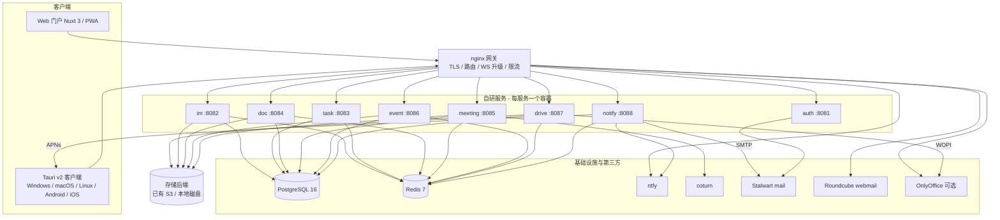
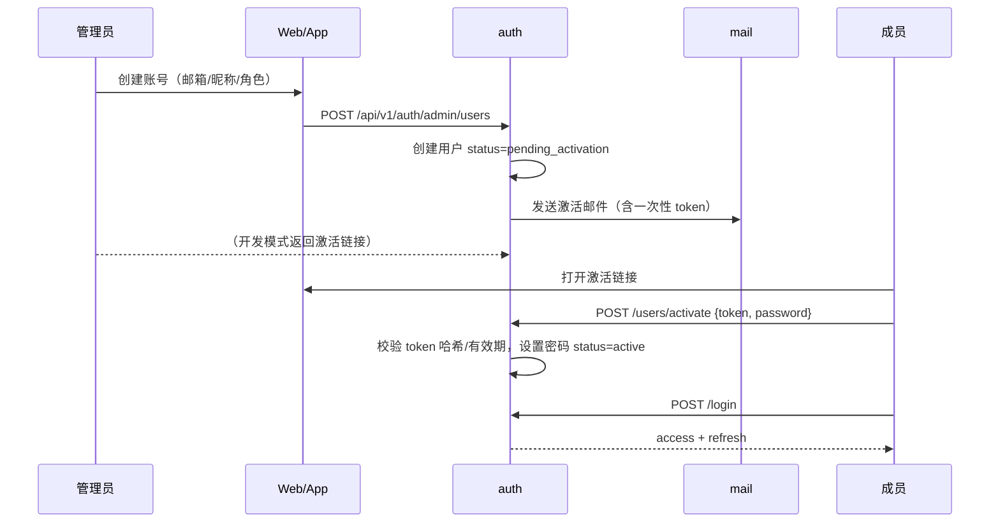
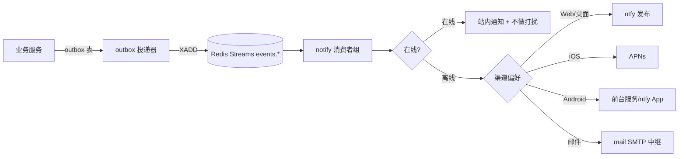

# 社团 OA 系统 架构设计文档

| 项目 | 内容 |
| --- | --- |
| 版本 | v0.1 |
| 日期 | 2026-09-13 |
| 状态 | M0 产出，与需求文档 v0.5 对齐 |
| 依据 | `docs/requirements.md`（需求基线，变更以该文档 0.4 节为准） |

---

## 1. 范围与原则

本文档定义系统的技术实现方案：服务边界、数据流、协议、部署与质量策略。需求细节以需求文档为准，本文不重复罗列功能点。

设计原则：

1. **一个功能一个服务、一个容器**：服务代码互相隔离，数据库按 schema 隔离。
2. **共享内核，不共享数据库**：通用逻辑放 `crates/*`，服务之间只通过 API 与事件通信。
3. **默认安全**：所有接口默认需要鉴权，游客通过 scope 化的短期令牌访问单一资源。
4. **可降级**：会议为条件模块；存储 S3/本地可切换；邮件出站可走中继。
5. **先契约后实现**：OpenAPI 由 utoipa 生成，前端 SDK 自动生成，禁止手写接口类型。

---

## 2. 总体架构



### 2.1 服务边界

| 服务 | 拥有的数据（schema） | 对外提供 | 依赖（同步） | 依赖（异步） |
| --- | --- | --- | --- | --- |
| auth | auth | 账号、令牌、JWKS、游客票据、用户资料 | mail（发信，失败降级记录重试） | - |
| im | im | 会话、消息、WS 实时 | auth（内部用户校验，缓存） | 全部模块事件作为通知源 |
| task | task | 项目、看板、任务 | auth | 发布 `task.*` |
| doc | doc | 空间、页面、版本、搜索 | auth、storage | 发布 `doc.*` |
| meeting | meeting | 会议、信令、SFU、白板、录制 | auth、storage | 发布 `meeting.*` |
| event | event | 活动、表单、报名、导出 | auth、mail | 发布 `event.*` |
| drive | drive | 网盘、分片、分享、WOPI Host | auth、storage、onlyoffice | 发布 `drive.*` |
| notify | notify | 站内通知、ntfy 桥接、APNs、邮件 | auth、ntfy、mail | 消费 `events.*` |

禁止事项：跨服务直接读写他方表；跨服务同步调用链超过一层（如 im → auth → mail 不允许，im 只调 auth 公共接口）。

---

## 3. 认证与授权实现

### 3.1 令牌体系

| 令牌 | 形态 | 有效期 | 存储 | 校验方 |
| --- | --- | --- | --- | --- |
| Access Token | JWT RS256 | 15 分钟 | 客户端内存 | 各服务本地验签（JWKS 缓存 10 分钟） |
| Refresh Token | 256-bit 随机串 | 30 天 | Web：BFF httpOnly Cookie；客户端：系统安全存储 | 仅 auth |
| WS 票据 | 随机串（Redis） | 30 秒、一次性 | - | im/meeting 向 auth 内部换取校验 |
| 游客 JWT | JWT RS256，scope 化 | 会议结束或 4 小时 | 客户端内存 | 各服务本地验签 + scope 校验 |
| 服务令牌 | HMAC-SHA256（服务名+时间戳+body 摘要） | 60 秒 | 环境变量 | 内部接口 |

Access Token claims：

```json
{
  "sub": "uuid",
  "name": "张三",
  "avatar": "avatars/xxx.webp",
  "roles": ["member"],
  "scopes": ["im", "doc"],
  "guest": false,
  "iss": "https://oa.example.com",
  "iat": 0, "exp": 0, "jti": "uuid"
}
```

- 密钥管理：`/run/secrets/jwt_private.pem`、`jwt_public.pem`；开发模式可自动生成并落在 `data/keys/`。
- 刷新旋转：refresh token 记录 `family_id` 与 `rotated_from`；检测到已旋转 token 再次使用即吊销整个 family（重放防御）。
- 登出：吊销 family；access token 依赖短 TTL，不入黑名单（降低复杂度）。
- 禁用用户：auth 返回 401 后客户端清空会话；各服务对 `status != active` 的请求由 auth 内部接口兜底（缓存 60 秒）。

### 3.2 账号生命周期（仅管理员建号）



### 3.3 SSO / OIDC

- auth 暴露 `/.well-known/openid-configuration` 与 `/.well-known/jwks.json`，作为 OIDC Provider。
- 第三阶段实现完整 Authorization Code + PKCE（Webmail SSO、第三方接入）；M1 先提供 JWKS/Discovery 与内部登录。
- 所有自研服务共享 `crates/auth-sdk` 完成 JWT 验签、角色/scope 提取、服务令牌校验。

### 3.4 权限模型

- RBAC：`superadmin` / `admin` / `member` + 模块管理员（`module_admin:{module}`）。
- 资源级：各服务自有的成员表（如 project_members、space_members、conversation_members）。
- 游客：JWT `guest=true`，`scopes=["meeting:{id}"]` 等资源 scope，服务端逐接口校验。
- 前端仅做展示控制，服务端为唯一裁决方。

---

## 4. 实时通信设计

### 4.1 IM WebSocket

- 端点：`GET /ws/im?ticket=...`（网关升级）。
- 连接注册：`(user_id, device_id, conn_id)` 三元组存 Redis；同用户多端在线。
- 消息投递路径：发送方 → im 服务（写库 + seq）→ Redis PubSub 频道 `im:conv:{id}` → 各实例投递在线成员 → 离线成员走通知流水线。
- 断线补偿：客户端持有每会话 `lastSeq`；重连后 `sync` 拉取差量（单次 ≤ 500 条）。
- 幂等：客户端 `clientMsgId` 唯一索引（`conversation_id + sender_id + client_msg_id`）。
- 顺序：每会话单调 `seq` 由 PG 序列生成，客户端按 seq 排序渲染。

### 4.2 会议信令与媒体

- 信令：`GET /ws/meeting/{roomId}`，JSON envelope。
- SFU：基于 `str0m` 的自研 SFU；单实例支持约 50~100 路视频，多实例级联扩展至单场 200 人；大会议模式默认仅演讲者发视频。
- 录制：meeting 容器内 GStreamer 合成宫格 + 混音，输出 MP4 到存储后端。
- TURN：coturn `--use-auth-secret`，meeting 签发临时凭据。
- 条件模块门禁：M6b 技术验证（压测/带宽/成本）通过后启动 M7/M8。

### 4.3 通知流水线



- 事件至少一次投递；消费者按事件 `id` 幂等（`notifications.event_id` 唯一）。
- outbox 与业务事务同库写入，后台任务投递，保证不丢。
- 通知内容只含摘要与深链，不携带正文。

---

## 5. 数据架构

### 5.1 PostgreSQL

- 单实例 + 每服务独立 schema：`auth` `im` `task` `doc` `meeting` `event` `drive` `notify`。
- 每服务独立数据库角色，仅授权自身 schema；连接时 `SET search_path TO {schema}, public`。
- 迁移：每服务一个 sea-orm-migration crate；服务启动时执行 `Migrator::up`，破坏性变更需人工评审并附备份步骤。
- 约定：
  - 主键 UUIDv7（时间有序）。
  - 时间 `timestamptz`（UTC）。
  - 软删除仅回收站使用（`deleted_at`），其余显式删除。
  - 大 JSON 使用 `jsonb` + GIN 索引。
- 扩展：`citext`、`pg_trgm`、`ltree`；中文分词 `pg_jieba` 为 P1（自定义 PG 镜像）。

### 5.2 Redis

| 用途 | Key 模式 | TTL |
| --- | --- | --- |
| WS 票据 | `ws:ticket:{token}` | 30s |
| 在线状态 | `presence:user:{id}` | 90s 心跳续期 |
| IM 频道 | `im:conv:{id}`（PubSub） | - |
| 事件流 | `events.{module}.{entity}.{action}`（Streams） | MAXLEN ~ 100k |
| 限流 | `rl:{scope}:{key}` | 按规则 |
| 验证码 | `vc:{purpose}:{target}` | 5 分钟 |

### 5.3 存储抽象（crates/storage）

```rust
#[async_trait]
pub trait StorageBackend: Send + Sync {
    async fn put(&self, key: &str, body: Bytes, content_type: &str) -> Result<()>;
    async fn get(&self, key: &str) -> Result<Bytes>;
    async fn delete(&self, key: &str) -> Result<()>;
    async fn presign_put(&self, key: &str, expires: Duration) -> Result<Option<String>>;
    async fn presign_get(&self, key: &str, expires: Duration, filename: Option<&str>) -> Result<String>;
    fn driver(&self) -> &'static str;
}
```

- `LocalBackend`：文件落盘 `STORAGE_LOCAL_PATH`，下载 HMAC 签名 URL（`/api/v1/{service}/files/{key}?exp=&sig=`），支持 nginx `X-Accel-Redirect`。
- `S3Backend`：`object_store`/S3 兼容（AWS S3、OSS、COS），预签名直传直下。
- 迁移工具 `storage-migrate`：local ↔ s3 双向搬运。

### 5.4 事件信封

```json
{
  "id": "uuid",
  "type": "task.assigned",
  "actorId": "uuid",
  "targetUsers": ["uuid"],
  "resource": { "type": "task", "id": "uuid", "url": "/tasks/uuid" },
  "title": "有新任务指派给你",
  "body": "「迎新活动物料」",
  "priority": "high",
  "createdAt": "2026-09-13T10:00:00Z",
  "dedupKey": "task.assigned:uuid"
}
```

---

## 6. API 约定

- 前缀 `/api/v1/{service}/...`；对外仅经 nginx。
- JSON camelCase；时间 RFC3339（UTC）；ID 为 UUID 字符串。
- 错误统一 RFC 7807（`crates/common::Error` 实现 `IntoResponse`）。
- 分页：游标 `?cursor=&limit=` → `{ "items": [], "nextCursor": null }`；管理台可用页码。
- 幂等：`Idempotency-Key` 头（消息发送、报名、导出等）。
- 内部接口：`/internal/*`，仅内网 + 服务令牌。
- 健康检查：`/healthz`（进程存活）、`/readyz`（依赖可用）。
- OpenAPI：utoipa 注解生成，CI 导出 `docs/api/*.json`；前端 `pnpm sdk:gen` 生成 `packages/core/sdk`。

---

## 7. 前端架构（Web）

```
apps/web/
├── app.vue
├── layouts/            # default（侧边栏）、auth（登录/激活）
├── pages/              # 路由（工作台/消息/任务/文档/会议/活动/网盘/通知/设置/管理）
├── components/         # 业务组件（非通用）
├── composables/        # useAuth useRealtime useNotify 等
├── stores/             # Pinia
├── server/             # BFF：登录代理、Cookie、API 转发、WS 票据
└── assets/css/         # Tailwind 入口 + 设计 token
```

- BFF 职责：持有 refresh（httpOnly Cookie）、注入 Authorization、聚合请求、统一错误。
- 数据获取：`$fetch` 经 BFF 转发；列表用 TanStack Query 缓存与失效。
- 实时：`packages/core` 的 `RealtimeClient`（自动重连、心跳、seq 补偿）。
- 权限指令：`v-can="'task:create'"` 控制展示。
- 设计系统：`packages/ui`（组件 + token），Web 与客户端共用。

---

## 8. 客户端架构（Tauri v2）

```
apps/app/
├── src/                # Vue 3 + Vite（与 Web 共享 packages/ui、packages/core）
├── src-tauri/
│   ├── src/            # Rust：托盘、单实例、通知、深链、前台服务（Android）
│   ├── capabilities/   # Tauri 权限
│   └── gen/            # android / apple 生成物（不入库构建产物）
```

- 平台适配层接口：`storage`、`notifier`、`filePicker`、`share`、`updater`、`webview`（会议能力探测）。
- 离线：SQLite 缓存（会话/消息/任务/活动），发送队列。
- 会议策略：会议能力探测（`canScreenShare()`），不支持时一键跳系统浏览器（透传登录态）。
- Android 后台：前台服务维持 ntfy WS；iOS 后台：APNs。

---

## 9. 邮件服务架构

- Stalwart（SMTP 25/465/587、IMAP 143/993、管理 REST API）+ Roundcube（OIDC SSO）。
- 出站：Stalwart → 邮件中继（587 提交）。
- 入站：MX → Stalwart（25）；若 25 被封，走收信转发（Webhook → LMTP）。
- auth 管理开通：调用 Stalwart Admin API 创建/停用邮箱；`email_accounts` 映射表。
- notify 发信：内网 SMTP submission + `noreply@` 账号。

---

## 10. 安全设计

见需求文档第 16 章。实现要点：

- 所有上传文件类型嗅探 + 大小限制 + 路径穿越防护（存储 Key 与用户文件名解耦）。
- Markdown 渲染白名单 sanitize；CSP 禁止内联脚本（仅 nuxt 构建产物哈希）。
- WOPI：短时 token + OnlyOffice JWT 双校验；Document Server 仅内网可达。
- 内部服务：服务令牌 HMAC + 时间戳防重放；数据库角色最小权限。
- 审计：登录、管理、分享、下载、删除写 `audit_logs` / `file_activities`，保留 180 天。

---

## 11. 部署与运维

### 11.1 Compose 拓扑

- 网络：`proxy`（仅 nginx）、`internal`（服务间，`internal: true`）。
- 卷：`pg_data` `redis_data` `storage_data` `nginx_data` `ntfy_data` `mail_data`。
- 端口：仅 nginx 80/443、coturn（3478/5349/UDP 段）、mail（25/465/587/993）对外。
- 资源：8C16G 起；启用会议 16C32G + 1Gbps；OnlyOffice 另加 2GB。

### 11.2 发布

- CI：lint → test（含覆盖率门禁）→ 构建多阶段镜像 → registry → `docker compose pull && up -d`。
- 迁移随服务启动执行；破坏性变更附备份步骤。
- 客户端：CI 构建桌面三平台 + Android AAB/APK + iOS 归档；桌面 Tauri Updater（nginx 静态清单）。

### 11.3 监控与备份

- 日志：JSON 到 stdout（Loki 可选）；traceId 贯穿。
- 健康检查 + `restart: unless-stopped`。
- 备份：`pg_dump`（30 天）、存储后端快照/同步、`mail_data` 备份；季度恢复演练；RPO ≤ 24h，RTO ≤ 4h。

---

## 12. 仓库与目录结构（微服务 + 子模块）

主仓库只含文档与部署编排；业务代码在 12 个独立组件仓库中，通过 `.gitmodules` 挂载：

```
club-oa/                        # 主仓库
├── libs/                       # [子模块] club-oa-libs（Cargo workspace：common/auth-sdk/storage/bus）
├── services/                   # [子模块] 每服务一个仓库 + 一个容器 + 一个 schema
│   ├── auth/                   #   club-oa-auth      独立 Cargo 工程 + sea-orm-migration
│   ├── im/ task/ doc/ meeting/ event/ drive/ notify/
├── apps/web/                   # [子模块] club-oa-web（Nuxt 3）
├── apps/app/                   # [子模块] club-oa-app（Tauri v2，五平台）
├── packages/                   # [子模块] club-oa-fe-libs（ui/core/config）
├── deploy/                     # docker-compose / nginx / mail / postgres / onlyoffice
├── scripts/                    # set-submodule-remotes.sh 等
└── docs/                       # 需求 / 架构 / 设计系统 / api
```

服务仓库的标准结构（以 auth 为例）：

```
club-oa-auth/
├── Cargo.toml                  # 单包工程；依赖 libs/crates/*（开发期 path，发布后 git tag）
├── src/
│   ├── main.rs                 # 启动装配：配置 → DB → 迁移 → 路由 → 优雅退出
│   ├── config.rs               # 环境变量配置（可单测）
│   ├── state.rs                # AppState（DB、密钥、Mailer、Clock）
│   ├── entity/                 # SeaORM 实体
│   ├── migration/              # sea-orm-migration（m20260913_000001_init 等）
│   ├── repo/                   # 数据访问（只操作本服务 schema）
│   ├── routes/                 # HTTP 处理器
│   └── services/               # 领域逻辑（纯函数优先，便于单测）
├── tests/                      # 集成测试（每测试独立 schema + Migrator::up）
├── Dockerfile
└── .github/workflows/ci.yml    # lint / test / 覆盖率 ≥ 80% / 镜像
```

依赖流向：`service → libs（auth-sdk/common/storage/bus）`；服务之间禁止代码级依赖。

---

## 13. 里程碑门禁

| 门禁 | 判定 |
| --- | --- |
| M1 完成 | auth 全流程可用（建号/激活/登录/刷新/游客票据），Web 可登录，CI 绿 |
| M3 完成 | 网盘/文档可用，存储抽象 local 与 S3 均验证，OnlyOffice 预览可用 |
| M6b 门禁 | 会议技术验证报告：50/100/200 人压测数据、带宽成本、录制 CPU；决定 M7/M8 是否执行及规模 |
| M10 | E2E 全绿、安全清单通过、部署文档齐备 |

---

## 14. ADR 摘要（对应需求文档 C1 ~ C17）

| ADR | 决策 | 影响 |
| --- | --- | --- |
| ADR-001 | 微服务 + 多仓库：每服务一个仓库/容器/schema，主仓库用 git submodule 挂载 | 独立开发发布、故障隔离；代价是版本对齐与联调成本 |
| ADR-002 | 每服务独立 schema + 独立角色 | 边界清晰，可平滑拆库 |
| ADR-003 | BFF（Web）+ 直连（客户端）双模式 | 安全与跨端兼顾 |
| ADR-004 | Redis Streams 事件总线 + outbox | 不引入 MQ，至少一次投递 |
| ADR-005 | 存储抽象（S3/本地） | 无 S3 可运行，可迁移 |
| ADR-006 | 会议条件模块 + M6b 门禁 | 控制最大风险项 |
| ADR-007 | OnlyOffice + WOPI | 标准协议，可选开关 |
| ADR-008 | APNs-only 推送 | Android 用前台服务/ntfy App |
| ADR-009 | 仅管理员建号 | 无开放注册攻击面 |
| ADR-010 | nginx 网关 + certbot | 运维习惯一致 |
| ADR-011 | TDD + 覆盖率 ≥ 80% CI 卡口 | 质量可控，回归成本低 |
| ADR-012 | 数据库访问使用 SeaORM + sea-orm-migration | 实体/迁移一体化，类型安全，开发效率高 |

---

## 15. 测试与质量工程

### 15.1 TDD 流程

所有功能与缺陷修复遵循「红 → 绿 → 重构」：

1. 先写测试（单元或集成），确认失败且失败原因符合预期。
2. 最小实现让测试通过。
3. 重构去重、分层，保持测试全绿。
4. 测试与实现同一提交（PR），Code Review 检查测试有效性而非仅覆盖率数字。

### 15.2 分层测试

| 层级 | 范围 | 工具 | 是否计入覆盖率 |
| --- | --- | --- | --- |
| 单元测试 | 纯逻辑：令牌、密码、claims、校验、序号、导出字段、分页 | `cargo test` / Vitest | 是 |
| 集成测试 | 服务 API + 真实 PostgreSQL（每测试独立 schema + SeaORM 迁移）、Redis（testcontainers） | `cargo test` | 是 |
| 组件测试 | Vue 组件交互、composables、store | Vitest + @vue/test-utils | 是 |
| E2E | 关键用户路径（登录、发消息、报名、文档保存、会议双人互通） | Playwright | 否 |
| 压测 | 消息吞吐、会议并发 | k6 | 否 |

### 15.3 覆盖率门禁

- 指标：行 / 语句 / 函数覆盖率 ≥ 80%，分支覆盖率 ≥ 70%。
- Rust：`cargo llvm-cov --workspace --all-features --fail-under-lines 80`（工具通过 `cargo install cargo-llvm-cov` 或 CI action 安装）。
- 前端：Vitest `coverage.thresholds` 配置 lines/statements/functions = 80，branches = 70，未达标直接失败。
- 排除项：`migrations/**`、生成的 SDK（`packages/core/sdk`）、纯样式文件、`main.rs` 启动装配——仅允许在覆盖率配置中显式排除，任何新增排除项需在 PR 说明理由。
- CI 报告（lcov + HTML）作为构建产物上传归档。

### 15.4 测试基建约定

- 每个服务提供 `tests/common/mod.rs`：启动测试应用（内存配置 + 测试 DB + 迁移）与请求辅助函数。
- 时间、随机数、ID 生成、邮件发送等通过 trait 注入，测试使用 Fake（如 `Mailer::Log`、`Clock::Fixed`），禁止在业务代码中直接调用 `Utc::now()`/`rand`。
- 外部依赖（S3、OnlyOffice、ntfy、APNs）在测试中用 `wiremock` 级别的替身，禁止真实外呼。
- flaky 测试零容忍：出现即修复或隔离（标 `#[ignore]` 并开 issue），不允许在 CI 重跑绕过。
