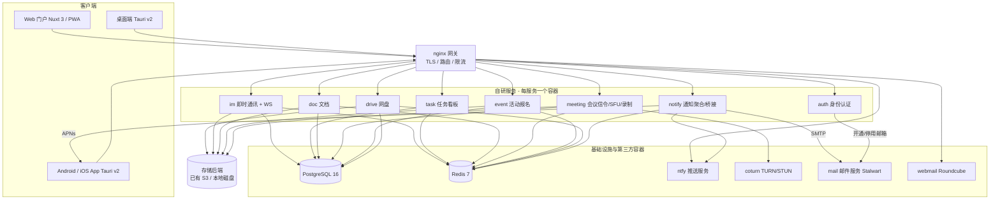
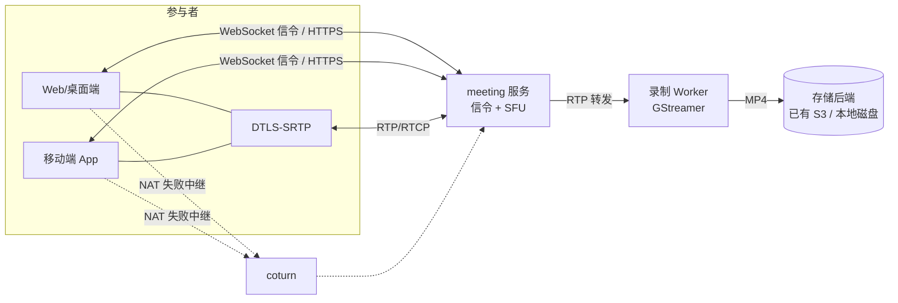
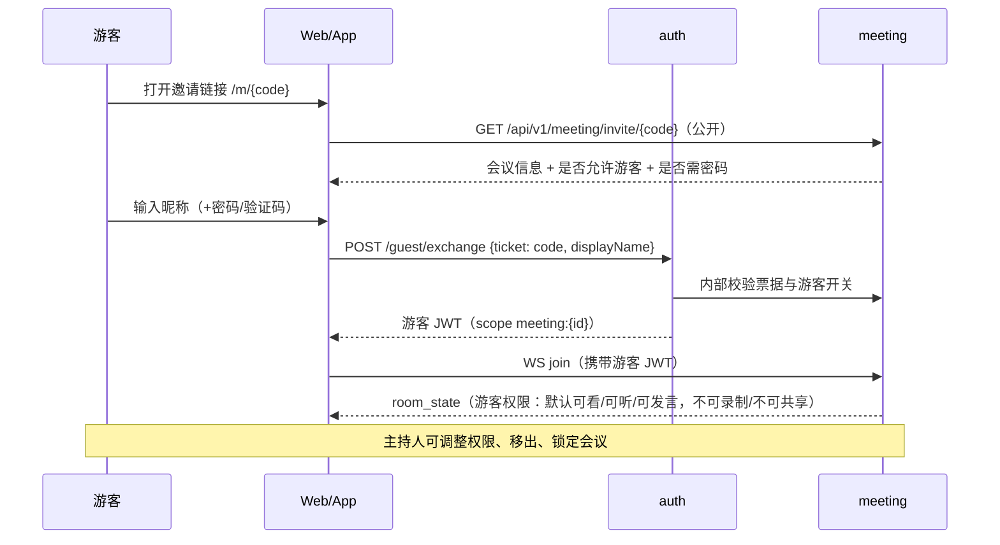
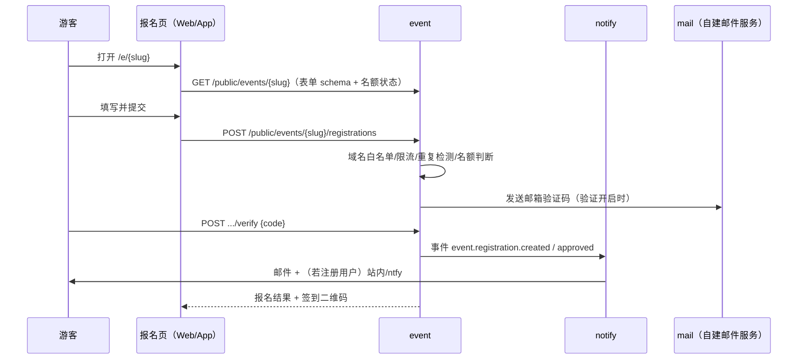

# 社团 OA 系统 需求规格说明书（SRS）

| 项目 | 内容 |
| --- | --- |
| 文档版本 | v0.8（需求已确认，待进入设计） |
| 日期 | 2026-09-13 |
| 状态 | 需求确认阶段，未开始编码 |
| 范围 | 需求定义 + 总体架构 + 接口约定 + 部署方案 |

---

## 0. 文档说明

### 0.1 优先级定义

| 标记 | 含义 |
| --- | --- |
| P0 | MVP 必须实现，缺失则系统不可用 |
| P1 | 增强功能，第一个大版本内实现，可按迭代排期 |
| P2 | 可选/后续版本，接口预留，不影响主流程 |

### 0.2 需求编号规则

`模块前缀-序号`，例如 `IM-001`、`MEET-012`、`MOB-005`。附录 A 提供原始需求到章节的追踪矩阵。

### 0.3 待确认项

需求决策记录见 20.2，剩余行动项（非需求决策）见 20.3。

### 0.4 变更记录

| 版本 | 日期 | 变更 |
| --- | --- | --- |
| v0.1 | 2026-09-13 | 初稿：IM、ntfy、任务看板、文档、会议、活动、认证、网盘、容器化等 |
| v0.2 | 2026-09-13 | 新增桌面端 App（Windows/macOS/Linux），Android/iOS 与桌面端统一 Tauri 单代码库 |
| v0.3 | 2026-09-13 | 存储改为 S3（连接已有）/本地双后端（去除 MinIO）；推送仅 APNs（去除 FCM）；任务看板确认自研；文档支持 Markdown 导入与 LaTeX、内嵌媒体；去除虚拟背景/美颜与 E2EE；会议规模提升至 200 人；App 直接上架；网关改用 nginx；游客禁评论、报名仅邮箱验证码（支持域名白名单与关闭验证）；新增域名邮箱服务（第 11 章） |
| v0.4 | 2026-09-13 | 用户确认 Q1 ~ Q14：关闭自助注册（仅管理员创建账号 + 邮箱激活）；存储可接入阿里云 OSS；邮件出站走中继；网盘 Office 预览接入 OnlyOffice（WOPI 标准协议）；App：iOS 上架 App Store、Android 官网 APK 直发（不上国内商店，Google Play 可选）；Apple 开发者账号将申请；其余按建议执行 |
| v0.5 | 2026-09-13 | 会议调整为条件模块：先执行技术验证（M6b），资源需求过高时可降级规模、仅保留基础会议或不做（C17）；待确认问题清单转为决策记录（20.2）与剩余行动项（20.3） |
| v0.6 | 2026-09-13 | 新增质量门禁：测试驱动开发（TDD）与覆盖率 ≥ 80%，CI 强制卡口（19.3） |
| v0.7 | 2026-09-13 | 仓库拆分：主仓库 + 12 个组件仓库（libs/8 服务/web/app/前端共享），git submodule 挂载；数据库访问层改用 SeaORM + sea-orm-migration |
| v0.8 | 2026-09-13 | 新增代码规范：函数必须有中文文档注释（极简函数除外），关键逻辑必须行内注释，Rust 公共项开启 missing_docs 检查 |

---

## 1. 项目概述

### 1.1 背景与目标

为社团建设一套自研、自托管、统一风格的一体化 OA 系统，覆盖日常协作的全部核心场景：即时通讯、消息推送、任务看板、文档协作、视频会议、活动报名、公共网盘，并以统一身份认证贯穿所有模块。系统按功能拆分为独立服务，每个服务独立 Docker 容器部署，便于升级与故障隔离。

### 1.2 建设目标

1. **统一**：统一账号、统一门户、统一 UI 风格、统一通知体系。
2. **自研可控**：核心功能全部自行实现，不依赖第三方 SaaS；外部仅使用基础设施与开源组件（PostgreSQL、Redis、ntfy、nginx、Stalwart 邮件服务等）。
3. **多端**：Web 门户 + Android/iOS App + 桌面端（Windows / macOS / Linux），App 统一使用 Tauri v2 单代码库多平台。
4. **开放**：非注册人员可通过邀请链接参与会议、报名活动、访问分享的网盘文件。
5. **可部署**：单机 Docker Compose 一键部署；预留横向扩展能力。

### 1.3 用户角色

| 角色 | 说明 | 权限范围 |
| --- | --- | --- |
| 游客 Guest | 未注册人员，通过邀请链接/报名页进入 | 仅限被邀请的具体资源（某场会议、某个活动、某条分享链接），临时会话 |
| 成员 Member | 注册用户 | 全部基础功能；访问自己参与的空间/会话/任务 |
| 管理员 Admin | 社团管理者/部门负责人 | 管理成员、全部内容、审计、系统配置；按模块可细分为模块管理员 |
| 超管 SuperAdmin | 系统所有者 | 全部权限 + 系统级配置（存储、ntfy、邮件、账号策略等） |
| 服务账号 | 服务间调用身份 | 内部 API，不出公网 |

> 已确认：支持模块级管理员角色（如活动管理员）。

### 1.4 术语表

| 术语 | 说明 |
| --- | --- |
| 会话 Conversation | IM 中单聊或群聊的统一抽象 |
| seq | 会话内消息单调递增序号，用于排序、已读、断线补偿 |
| SFU | Selective Forwarding Unit，选择性转发单元，多人会议媒体服务器 |
| TURN | 中继服务器，NAT 穿透失败时的媒体中继 |
| 游客会话 | 基于短期 JWT 的临时身份，绑定单一资源 |
| 存储后端 | 统一存储抽象：S3 模式连接已有 S3 兼容服务（AWS S3/阿里云 OSS/腾讯 COS 等），本地模式落盘至服务器磁盘；由 `crates/storage` 实现，配置切换 |
| WOPI | Web Application Open Platform Interface，微软制定的在线 Office 集成标准协议；本项目用于对接 OnlyOffice 实现网盘 Office 文件在线预览/编辑 |
| BFF | Backend For Frontend，前端服务端聚合层（Nuxt Server Routes） |

---

## 2. 总体架构

### 2.1 架构总览



### 2.2 服务/容器清单

| 容器名 | 类型 | 技术栈 | 职责 | 内部端口 |
| --- | --- | --- | --- | --- |
| gateway | 基础设施 | nginx | TLS 终止（Let's Encrypt/自有证书）、反向代理、WebSocket 升级、路由、限流、静态文件（下载页/更新包） | 80/443 |
| web | 自研前端 | Nuxt 3 + Vue 3 + Tailwind | Web 门户、BFF | 3000 |
| auth | 自研后端 | Rust + axum | 账号管理（管理员创建/邮箱激活）、登录、OIDC、用户中心、游客票据 | 8081 |
| im | 自研后端 | Rust + axum + tokio | 会话/消息/WebSocket、媒体处理 | 8082 |
| task | 自研后端 | Rust + axum | 任务看板 | 8083 |
| doc | 自研后端 | Rust + axum | 文档 CRUD/版本/搜索 | 8084 |
| meeting | 自研后端 | Rust + str0m/webrtc-rs + GStreamer | 信令、房间、SFU、录制 | 8085 |
| event | 自研后端 | Rust + axum | 活动、表单、报名、导出 | 8086 |
| drive | 自研后端 | Rust + axum | 网盘、预签名、分片、分享 | 8087 |
| notify | 自研后端 | Rust + axum | 通知聚合、偏好、ntfy 桥接、APNs 推送 | 8088 |
| ntfy | 第三方 | ntfy | 推送订阅与分发 | 8090 |
| coturn | 基础设施 | coturn | STUN/TURN 媒体中继 | 3478/5349 |
| mail | 第三方 | Stalwart（Rust） | 域名邮箱：SMTP/IMAP/JMAP、反垃圾 | 25/465/587/993 |
| webmail | 第三方 | Roundcube | 网页邮箱（OIDC 单点登录） | 80 |
| onlyoffice | 第三方（可选） | OnlyOffice Document Server | Office 在线预览/编辑（WOPI，可开关） | 80 |
| certbot | 基础设施（可选） | certbot | Let's Encrypt 证书自动签发/续期 | - |
| postgres | 基础设施 | PostgreSQL 16 | 主数据库（按服务分 schema） | 5432 |
| redis | 基础设施 | Redis 7 | 缓存、会话、事件总线（Streams） | 6379 |

- 存储后端不在容器清单内：优先连接**已有 S3 兼容服务**（AWS S3、阿里云 OSS、腾讯 COS 等）；无 S3 时使用**本地磁盘后端**（挂载卷 `storage_data`），由 `crates/storage` 统一抽象、配置切换。
- 桌面端与移动端 App 为构建产物，不占容器；构建与分发见 13.7 与第 18 章。

### 2.3 技术选型

| 层 | 选型 | 说明 |
| --- | --- | --- |
| 后端语言 | Rust（stable，edition 2021+） | 统一所有自研服务 |
| Web 框架 | axum + tokio + tower | 统一 HTTP/WS 技术栈 |
| ORM | SeaORM（async，底层 sqlx 驱动） | 实体/关系/查询/迁移一体，类型安全，减少样板 |
| 迁移工具 | sea-orm-migration（sea-orm-cli） | 每服务独立 migration crate，启动时 `Migrator::up` |
| 鉴权 | jsonwebtoken（RS256）+ JWKS | 各服务本地验签，不回调 auth |
| 实时通信 | tokio-tungstenite / axum ws | IM 与会议信令 |
| 存储后端 | aws-sdk-s3 + 本地文件实现（`crates/storage` 统一抽象） | S3 连接已有服务（AWS/OSS/COS 等）；无 S3 时自动切换本地磁盘 |
| 网关 | nginx | TLS、反向代理、WebSocket 升级、限流、静态文件 |
| 邮件服务 | Stalwart + Roundcube | 域名邮箱、Webmail、SMTP 发信，OIDC 单点登录 |
| Excel 导出 | rust_xlsxwriter | 活动报名导出 |
| 图片处理 | image crate | 缩略图；视频缩略图/时长用 ffmpeg |
| 会议媒体 | str0m（优先）或 webrtc-rs | 自研 SFU；录制用 GStreamer |
| Web 前端 | Nuxt 3（Vue 3 + TS）+ Tailwind CSS + Pinia + TanStack Query | 统一门户 |
| 文档编辑器 | Milkdown（ProseMirror）+ KaTeX + 自定义插件 | 所见即所得 Markdown/LaTeX，内嵌图片与视频 |
| Office 预览 | OnlyOffice Document Server + WOPI | 网盘内 Office 文件在线预览；编辑 P2 可开，可整体禁用 |
| 客户端 App | Tauri v2 + Vite + Vue 3 + Tailwind | Windows/macOS/Linux/Android/iOS，复用组件与 SDK |
| API 文档 | utoipa 生成 OpenAPI 3 | 前端 SDK 由 openapi-typescript 生成 |
| 可观测性 | tracing + OpenTelemetry（可选接入 Loki/Grafana） | 结构化日志到 stdout |
| 测试 | Rust: cargo test + testcontainers；前端: Vitest；E2E: Playwright | CI 全量执行 |

### 2.4 仓库结构（微服务 + 多仓库 + 子模块）

**微服务原则（已确认，强制执行）**：

- 每个后端服务 = 一个 Git 仓库 = 一个容器 = 一个数据库 schema，独立构建、独立发布、独立扩缩容。
- 服务之间只通过 HTTP API 与事件总线通信；**禁止**共享进程、共享数据库表、跨服务查库。
- 共享代码只存在于库仓库（`libs` / `packages`）中，且必须是纯库（无运行时状态）。

主仓库（club-oa）只存放文档、部署编排与子模块引用，不包含业务代码：

```
club-oa/                      # 主仓库：docs + deploy + scripts + 子模块
├── libs/                     # 子模块 club-oa-libs：共享 Rust 库
│   └── crates/{common,auth-sdk,storage,bus}/
├── services/                 # 每个子目录 = 一个独立服务仓库 + 一个容器
│   ├── auth/                 # club-oa-auth（:8081，schema auth）
│   ├── im/                   # club-oa-im（:8082，schema im）
│   ├── task/                 # club-oa-task（:8083，schema task）
│   ├── doc/                  # club-oa-doc（:8084，schema doc）
│   ├── meeting/              # club-oa-meeting（:8085，schema meeting，条件模块）
│   ├── event/                # club-oa-event（:8086，schema event）
│   ├── drive/                # club-oa-drive（:8087，schema drive）
│   └── notify/               # club-oa-notify（:8088，schema notify）
├── apps/
│   ├── web/                  # 子模块 club-oa-web（Nuxt 3 门户 + BFF）
│   └── app/                  # 子模块 club-oa-app（Tauri v2 客户端，五平台）
├── packages/                 # 子模块 club-oa-fe-libs（ui / core / config）
├── deploy/                   # docker-compose / nginx / mail / postgres 初始化
├── scripts/                  # 子模块远程地址切换等脚本
└── docs/                     # requirements / architecture / design-system / api
```

- 组件仓库清单（12 个）：club-oa-libs、club-oa-auth、club-oa-im、club-oa-task、club-oa-doc、club-oa-meeting、club-oa-event、club-oa-drive、club-oa-notify、club-oa-web、club-oa-app、club-oa-fe-libs。
- 依赖方式：开发期服务仓库通过主仓库子模块布局使用相对路径依赖 (`../../libs/crates/*`)；远程托管后切换为 git tag 依赖并锁定版本。
- 每个服务仓库必须自带：Cargo 工程（SeaORM + sea-orm-migration）、Dockerfile、健康检查、CI（含覆盖率门禁）、README。
- 主仓库通过 `.gitmodules` 固定各组件版本；升级组件 = 更新子模块指针。

### 2.5 关键架构决策

| 编号 | 决策 | 结论 | 理由 |
| --- | --- | --- | --- |
| D1 | 任务看板实现 | **自研**（已确认） | Plane/Django 过重；与统一认证/风格深度整合 |
| D2 | Web 前端形态 | **单一 Nuxt 门户**（推荐） | 统一风格、统一登录、共享组件 |
| D3 | 数据库 | 单实例 PostgreSQL，按服务分 schema | 部署简单；后续可平滑拆库 |
| D4 | 服务间通信 | 同步 HTTP（内网 + 服务令牌）+ 异步 Redis Streams | 避免引入 MQ 中间件 |
| D5 | 令牌传递 | Web 走 BFF + httpOnly Cookie；客户端直连 + 系统安全存储 | 安全与跨端兼顾 |
| D6 | 客户端框架 | Tauri v2（Windows/macOS/Linux/Android/iOS） | 用户指定；单代码库多平台，复用 Vue 组件与 Rust 能力 |
| D7 | 推送 | ntfy 为统一通知总线；桌面端常驻订阅；iOS 后台推送经 notify 直连 APNs；Android 不依赖 FCM（前台服务/ntfy App） | 已确认仅支持 APNs |
| D8 | 存储后端 | `crates/storage` 抽象：S3（连接已有服务）与本地磁盘双实现，配置切换 | 不使用已停更的 MinIO；无 S3 时可零依赖运行 |
| D9 | 邮件服务 | 自建 Stalwart + Roundcube，成员域名邮箱 | 开源、轻量、支持 API 自动开通与 OIDC SSO |
| D10 | 网关 | nginx（替代 Caddy） | 部署环境既有运维习惯 |
| D11 | 账号策略 | 关闭自助注册，仅管理员创建账号，邮箱激活后设置密码 | 已确认（见 20.2） |
| D12 | 邮件发信 | 出站统一走邮件中继（smarthost/relay） | 提升送达率；入站方案部署前确认 |
| D13 | Office 预览 | OnlyOffice Document Server + WOPI 标准协议，可开关 | 已确认 |

> 已确认：客户端直连 API + 系统安全存储令牌（Keychain/Keystore/凭据管理器）。

### 2.6 非注册人员接入总体设计

| 场景 | 入口 | 身份 | 会话有效期 | 约束 |
| --- | --- | --- | --- | --- |
| 视频会议 | 邀请链接 `/m/{code}` | 游客 JWT（scope: `meeting:{id}`） | 会议结束或 4 小时 | 需会议开启"允许游客"；主持人可设置游客权限、移出；可开等候室 |
| 活动报名 | 公开报名页 `/e/{slug}` | 无需账号，仅报名记录 | 一次性 | 仅邮箱验证码（可限制域名/可关闭）、防刷限流、重复报名检测 |
| 网盘分享 | 分享链接 `/s/{token}` | 无需账号（可选密码） | 按分享有效期 | 只读/可下载/可上传（可配），次数与有效期限制 |
| 文档分享 | 分享链接 `/d/{token}` | 无需账号（可选密码） | 按分享有效期 | 仅只读（禁止游客评论） |

游客统一由 auth 服务的"游客票据交换"接口签发短期 JWT，各服务通过共享的 `auth-sdk` 验签并校验 scope；游客不能访问任何未授权接口。

---

## 3. 统一身份认证（auth 服务）

### 3.1 目标

- 所有模块唯一账号体系，SSO 一次登录全站通行。
- 对外提供标准 OIDC Provider 能力，可为第三方系统（如自建监控、Wiki）提供登录。
- 支持游客票据，服务非注册人员场景。

### 3.2 功能需求

| 编号 | 需求 | 优先级 |
| --- | --- | --- |
| AUTH-001 | 账号创建：**关闭自助注册**，仅管理员创建账号；成员收到激活邮件后设置密码；管理员创建时可限制邮箱域名（可配置白名单） | P0 |
| AUTH-002 | 登录：用户名或邮箱 + 密码；登录失败次数限制与锁定 | P0 |
| AUTH-003 | 令牌：Access JWT（RS256，15 分钟）+ Refresh Token（随机串，30 天，旋转 + 重放检测） | P0 |
| AUTH-004 | JWKS 与 OIDC Discovery：`/.well-known/openid-configuration`、`/.well-known/jwks.json` | P0 |
| AUTH-005 | OIDC 授权码 + PKCE 流程（Web/移动端/SDK） | P0 |
| AUTH-006 | 用户资料：昵称、头像、邮箱、手机、简介、部门/小组、加入时间 | P0 |
| AUTH-007 | 修改密码、忘记密码（邮件重置）、退出登录（单端/全部端） | P0 |
| AUTH-008 | RBAC：superadmin / admin / member；模块管理员（活动管理员等） | P0 |
| AUTH-009 | 管理后台：成员列表、创建账号（单个/批量）、禁用/启用、重置密码、角色分配、审计日志 | P0 |
| AUTH-010 | 游客票据：会议邀请/分享链接换取短期游客 JWT（scope 化） | P0 |
| AUTH-011 | 用户搜索与通讯录（供 IM 选人、任务指派、分享使用） | P0 |
| AUTH-012 | 头像上传（存储后端，裁剪为多尺寸） | P1 |
| AUTH-013 | TOTP 两步验证（管理员可强制） | P1 |
| AUTH-014 | 登录设备管理（查看/踢出已登录设备） | P1 |
| AUTH-015 | 第三方 OAuth 登录（如 GitHub/微信，预留适配层） | P2 |
| AUTH-016 | 域名邮箱开通：为成员创建/停用 `username@社团域名` 邮箱（调用 mail 服务 API，见第 11 章） | P1 |

### 3.3 数据模型（schema: auth）

| 表 | 关键字段 |
| --- | --- |
| users | id (uuidv7), username, email, phone, password_hash (argon2id), nickname, avatar_key, bio, department, status, created_at |
| roles | id, code (superadmin/admin/member/module_admin), name |
| user_roles | user_id, role_id, module |
| refresh_tokens | id, user_id, token_hash, device_id, user_agent, ip, expires_at, rotated_from, revoked_at |
| activation_tokens | id, user_id, token_hash, purpose (activate/reset), expires_at, used_at |
| email_verifications | id, email, code_hash, purpose, expires_at, used_at |
| audit_logs | id, actor_id, action, target_type, target_id, detail jsonb, ip, ua, created_at |
| guest_grants | id, resource_type, resource_id, ticket_hash, created_by, expires_at, used_at, meta jsonb |

### 3.4 API 摘要（/api/v1/auth）

| 方法 | 路径 | 说明 |
| --- | --- | --- |
| POST | /admin/users | 管理员创建账号（发送激活邮件） |
| POST | /users/activate | 激活账号并设置密码（凭激活令牌） |
| POST | /login | 密码登录，返回 access + refresh（refresh 走 httpOnly Cookie 或响应体，依客户端而定） |
| POST | /refresh | 刷新令牌（旋转） |
| POST | /logout | 退出（单端/全部） |
| GET | /me | 当前用户信息与权限 |
| PATCH | /me | 更新资料 |
| PUT | /me/password | 修改密码 |
| POST | /password/forgot, /password/reset | 忘记密码流程 |
| GET | /users/search?q= | 用户搜索（供其他模块调用） |
| CRUD | /admin/users, /admin/roles | 管理接口（admin） |
| POST | /guest/exchange | 游客票据换取游客 JWT |
| GET | /.well-known/openid-configuration, /.well-known/jwks.json | OIDC 标准端点 |

### 3.5 令牌与 SSO 细节

- Access Token Claims：`sub, name, avatar, roles[], scopes[], mod[], exp, iat, iss, jti`。
- 各服务使用 `crates/auth-sdk` 从 JWKS 本地验签（缓存 10 分钟，支持轮换）；不逐请求回调 auth。
- Web（BFF）：登录后 Refresh Token 存 httpOnly + Secure + SameSite=Lax Cookie；Access Token 仅存内存；Nuxt Server Routes 代理浏览器请求并注入 Authorization。
- 客户端（桌面/移动）：登录/刷新直连网关；Refresh Token 存系统安全存储（iOS Keychain、Android Keystore、Windows 凭据管理器、macOS Keychain、Linux Secret Service，通过 Stronghold 或等价插件）；Access Token 仅存内存。
- 登出/禁用：Redis 维护 `revoked_jti` 与 `user_disabled` 标记，各服务校验时检查短 TTL 黑名单缓存。

### 3.6 游客身份

```
POST /api/v1/auth/guest/exchange
{ "ticket": "<邀请码或分享令牌>", "resourceType": "meeting|drive|doc", "displayName": "张三", "captchaToken": "..." }
→ { "accessToken": "<JWT scope=meeting:xxx;role=guest>", "expiresIn": 14400, "profile": {...} }
```

- 票据由资源服务（meeting/drive/doc）生成，auth 通过内部接口校验票据有效性。
- 游客 JWT 的 `sub = guest:{grant_id}`，`scopes` 严格限定资源，不能调用其他 API。
- 可配置会议室密码/报名邮箱验证，作为票据之外的二次校验。

---

## 4. 即时通讯（im 服务）

### 4.1 功能需求

| 编号 | 需求 | 优先级 |
| --- | --- | --- |
| IM-001 | 单聊：选择联系人发起，双方自动建会话 | P0 |
| IM-002 | 群聊：创建群、修改群名/头像/公告、邀请成员、移出成员、设置管理员、退群、解散 | P0 |
| IM-003 | 文本消息：支持 Markdown 子集（加粗/斜体/链接/行内代码/代码块）、表情、@提及 | P0 |
| IM-004 | 图片消息：多图、粘贴上传、缩略图、点击预览（缩放、切换、下载） | P0 |
| IM-005 | 视频消息：上传、封面与时长、内嵌播放器 | P0 |
| IM-006 | 文件消息：任意文件上传（类型/大小白名单）、文件名/大小/图标、下载 | P0 |
| IM-007 | 引用消息：回复指定消息，展示被引用摘要，点击跳转原消息；被引用消息撤回后显示占位 | P0 |
| IM-008 | 已读/未读：单聊显示对方已读状态；群聊显示"N 人已读"并可展开成员列表；用户可关闭已读回执 | P0 |
| IM-009 | 未读数：会话列表未读角标、全局未读总数、@我的特别标记 | P0 |
| IM-010 | 消息同步：多端在线同步；离线消息登录后按序拉取；断线重连补偿 | P0 |
| IM-011 | 撤回：2 分钟内可撤回（群主/管理员可撤回任意消息，可配） | P0 |
| IM-012 | 输入中状态（typing）与在线状态（presence，可隐身） | P1 |
| IM-013 | 消息搜索：会话内搜索、全局搜索（联系人/群/消息） | P1 |
| IM-014 | 消息编辑（显示已编辑标记） | P2 |
| IM-015 | 转发（单条/多条合并）、收藏、置顶会话、消息免打扰 | P1 |
| IM-016 | 系统消息：入群、退群、群名变更等 | P0 |
| IM-017 | 会话管理：删除会话（本地）、清空聊天记录（本地）、会话归档 | P1 |
| IM-018 | 文件转发至网盘（IM 文件保存到个人网盘） | P2 |

### 4.2 数据模型（schema: im）

| 表 | 关键字段 |
| --- | --- |
| conversations | id, type (direct/group), name, avatar_key, owner_id, notice, settings jsonb, created_at |
| conversation_members | conversation_id, user_id, role (owner/admin/member), last_read_seq, muted, pinned, joined_at, left_at |
| messages | id (uuidv7), conversation_id, seq (bigint，会话内递增), sender_id, type (text/image/video/file/system), content jsonb, reply_to_id, client_msg_id, status, created_at, edited_at, recalled_at |
| attachments | id, message_id, kind, s3_key, thumb_key, filename, mime, size, width, height, duration_ms |
| read_receipts | conversation_id, user_id, last_read_seq, updated_at（仅存最新位点） |
| message_seq | conversation_id, next_seq（或使用 PG sequence） |
| user_presence | user_id, online, last_seen_at, device_count（Redis 为主，PG 落快照） |

消息内容 `content` 按类型约定：

```json
// text
{ "text": "内容", "mentions": ["user_id"] }
// image / video / file（统一附件结构，可带文字说明）
{ "text": "说明（可空）", "attachments": [{ "id": "...", "name": "a.png", "mime": "image/png", "size": 12345, "w": 800, "h": 600, "durationMs": null }] }
// system
{ "event": "member_joined", "params": { "userId": "..." } }
```

### 4.3 WebSocket 协议（/ws/im）

- 连接鉴权：`?ticket=` 一次性 WS 票据（由 BFF/客户端用 Access Token 换取，30 秒有效），避免 token 出现在 URL 日志。
-  envelope：`{ "type": "...", "requestId": "...", "payload": {...} }`，UTF-8 JSON；心跳 `ping/pong` 每 20s，60s 无响应断开。
- 一个用户可建立多端连接（deviceId 区分）。

客户端 → 服务端：

| type | payload | 说明 |
| --- | --- | --- |
| send_message | conversationId, clientMsgId, type, content, replyToId | 发送消息（clientMsgId 幂等） |
| ack | messageId | 客户端确认收到（用于服务端重推判断） |
| read | conversationId, seq | 上报已读位点 |
| typing | conversationId, state | 输入中开始/结束（节流） |
| sync | cursor (last seq per conv / global) | 断线补偿拉取 |
| recall | messageId | 撤回 |
| ping | - | 心跳 |

服务端 → 客户端：

| type | payload | 说明 |
| --- | --- | --- |
| message | message 对象 | 新消息（含 seq） |
| message_ack | clientMsgId → messageId, seq, createdAt | 发送成功回执 |
| read_update | conversationId, userId, lastReadSeq | 对方/成员已读更新 |
| typing | conversationId, userId, state | 输入状态 |
| presence | userId, online, lastSeenAt | 在线状态 |
| conversation_update | conversation 对象 | 会话变更（拉群、改名等） |
| kicked | reason | 被移出/禁用 |
| error | code, message, requestId | 错误 |
| pong | - | 心跳响应 |

断线补偿策略：客户端记录每会话最大 seq；重连后 `sync` 上报，服务端返回缺失消息（单次上限 500 条，超出提示分页拉取）。

### 4.4 REST API 摘要（/api/v1/im）

| 方法 | 路径 | 说明 |
| --- | --- | --- |
| GET | /conversations | 会话列表（含最后一条消息、未读数） |
| POST | /conversations | 创建单聊/群聊 |
| GET | /conversations/{id} | 会话详情与成员 |
| PATCH | /conversations/{id} | 改名/公告/设置 |
| POST | /conversations/{id}/members, DELETE .../members/{uid} | 拉人/移出 |
| GET | /conversations/{id}/messages?beforeSeq=&limit= | 历史消息（游标分页） |
| POST | /conversations/{id}/messages | HTTP 发送（WS 不可用降级） |
| GET | /conversations/{id}/read-receipts?messageId= | 已读详情（成员列表） |
| POST | /messages/{id}/recall | 撤回 |
| POST | /upload/presign | 申请直传凭证（S3 预签名；本地后端返回签名上传 URL） |
| POST | /upload/complete | 上传完成回调（入队生成缩略图/时长） |
| GET | /search?q=&scope= | 搜索消息/会话 |
| POST | /ws-ticket | 换取 WS 连接票据 |

### 4.5 文件与媒体处理

- 上传：客户端向 im 服务申请预签名/签名 URL → 直传 S3 或本地存储后端（`im/{convId}/{yyyy}{mm}/{uuid}.{ext}`）→ 调用 complete → 生成缩略图。
- 图片：服务端 `image` crate 生成 256px 缩略图，记录宽高；原图保留。
- 视频：ffmpeg 抽首帧作封面、读取时长；转码不做（P2 可选生成 720p 预览）。
- 限制：单文件默认 100MB（可配），图片白名单 jpg/png/gif/webp/heic，视频 mp4/webm/mov，其他文件做类型检测（magic number）并禁止可执行文件；文件名转义防路径穿越。
- 下载：短时预签名 URL，附件名按 RFC 5987 编码。

### 4.6 边界与限制

- 单群上限默认 500 人（可配）；消息体上限 16KB。
- 发送频率限制：单用户 20 条/10 秒，防刷。
- 敏感词/违规内容过滤预留接口（P2）。

---

## 5. 消息推送与通知中心（notify 服务 + ntfy）

### 5.1 目标与通道

| 通道 | 适用端 | 说明 |
| --- | --- | --- |
| 站内通知 | 全部 | 通知中心列表、未读角标、详情跳转 |
| ntfy 实时推送 | Web / PWA / 桌面端 | 浏览器 Service Worker 或 SSE 订阅；桌面通知 |
| ntfy 即时推送 | Android/iOS 前台 | App 内订阅 SSE/WebSocket |
| APNs | iOS 后台 | notify 服务直连 APNs（HTTP/2 + JWT）；需 Apple 开发者账号与 APNs 密钥；**不集成 FCM** |
| Android 常驻通知 | Android 后台 | 不依赖 FCM：App 内前台服务维持 ntfy WebSocket 并转本地通知（P1）；或安装官方 ntfy App（零开发） |
| 邮件 | 全部 | 经自建 mail 服务发信：账号激活、密码重置、活动通知等；**不提供短信通道** |

- 已确认：仅支持 APNs；Android 后台推送方案详见 13.6。

### 5.2 ntfy 集成设计

- 自托管 ntfy 容器，仅暴露给网关（`/ntfy/*`）与内网，不直接公网开放 8090。
- 主题命名：`u_{user_id}`（用户级）、`g_{group_id}`（群组级，P2）；主题不可猜测。
- 认证：notify 服务通过 ntfy Admin API 为每个用户创建 ntfy 用户与访问令牌（或统一使用服务端签名）；订阅端携带 token，ACL 限制仅能读写自己的主题。
- 发布：notify 服务是唯一发布者；消息体仅含标题/摘要/跳转链接，不携带敏感正文（正文在站内通知里看）。
- 优先级映射：IM 私聊 > @提及 > 任务指派 > 活动通知 > 系统公告。
- 附加能力：`click` 深链（App 用 deep-link 唤起，Web 用路由）、`actions`（标记已读、打开）、`tags`、限流合并（同一会话 N 秒内多条合并为一条）。

### 5.3 notify 服务职责

| 编号 | 需求 | 优先级 |
| --- | --- | --- |
| NOTIFY-001 | 事件消费：订阅 Redis Streams `events.*`，落库站内通知 | P0 |
| NOTIFY-002 | 在线判断：查询 Redis 在线状态，在线用户仅站内、离线用户发 ntfy | P0 |
| NOTIFY-003 | 用户偏好：模块级开关、免打扰时段、桌面通知开关 | P1 |
| NOTIFY-004 | 推送历史：查询、已读、全部已读、清理 | P0 |
| NOTIFY-005 | iOS 设备注册：上报 APNs device token、失效清理 | P1 |
| NOTIFY-006 | APNs 推送发送（HTTP/2 + JWT 鉴权），Payload 仅含摘要与深链 | P1 |
| NOTIFY-007 | 邮件发送（经自建 mail 服务 SMTP，模板管理） | P0 |
| NOTIFY-008 | ntfy 主题/用户/ACL 自动管理 | P0 |
| NOTIFY-009 | 通知聚合：同类通知折叠（如"3 条新消息"） | P2 |

### 5.4 通知事件目录（示例）

| 事件 | 来源 | 目标用户 | 优先级 | 点击跳转 |
| --- | --- | --- | --- | --- |
| `im.message.created` | im | 会话成员（排除发送者） | high | `/im/{convId}` |
| `im.message.mentioned` | im | 被 @ 成员 | urgent | `/im/{convId}?msg=` |
| `task.assigned` | task | 负责人 | high | `/tasks/{id}` |
| `task.due_soon` | task（定时扫描） | 负责人/协作者 | default | `/tasks/{id}` |
| `task.comment.added` | task | 任务成员 | default | `/tasks/{id}` |
| `doc.mentioned` | doc | 被提及用户 | high | `/docs/{id}` |
| `doc.comment.added` | doc | 文档成员 | default | `/docs/{id}` |
| `meeting.invited` | meeting | 受邀成员/游客邮箱 | high | `/meet/{code}` |
| `meeting.started` | meeting | 受邀成员 | urgent | `/meet/{code}` |
| `meeting.recording.ready` | meeting | 主持人/参会者 | default | `/drive/recordings` |
| `event.registration.created` | event | 活动管理员 | default | `/events/{id}/registrations` |
| `event.registration.approved` | event | 报名者（邮箱/站内） | high | `/events/{slug}` |
| `event.reminder` | event（定时） | 已报名用户 | high | `/events/{slug}` |
| `drive.share.created` | drive | 被分享用户 | default | `/drive/share/{token}` |
| `system.announcement` | 管理后台 | 全部/指定角色 | high | `/notifications` |

事件信封统一为：`{ id, type, actorId, targetUsers[], resource: {type, id, url}, title, body, priority, createdAt, dedupKey? }`。

### 5.5 前端订阅与 PWA

- Web：注册 Service Worker；用户登录后通过 SSE `GET /ntfy/u_{uid}/sse` 订阅；收到后发 Notification 并刷新站内角标；点击聚焦对应页面。
- iOS Web Push：iOS 16.4+ 且"添加到主屏幕"后可用；ntfy 支持 Web Push（VAPID），需 HTTPS。
- 桌面端（Tauri）：Rust 侧可常驻 ntfy WS 订阅，弹系统通知，支持点击深链。
- 移动端：前台 SSE/WS；iOS 后台走 APNs（见 5.1/13.6）；Android 后台走应用内常驻通知服务或官方 ntfy App。
- 权限申请时机：用户首次开启通知时请求，不强制。

### 5.6 隐私

- 推送内容不包含消息正文（仅"张三：你有一条新消息"）。
- 免打扰时段不打断，仅站内静默累积。
- 用户可随时关闭任意通道。

---

## 6. 任务看板（task 服务）

### 6.1 实现方案对比

| 维度 | 方案 A：Plane 后端 | 方案 B：自研（已确认） |
| --- | --- | --- |
| 技术栈 | Django + DRF + Next.js + Redis + RabbitMQ | Rust + axum + Vue |
| 集成成本 | 需对接 OIDC/同步用户/改造前端，风格难统一 | 原生统一认证与风格 |
| 部署重量 | 多容器、资源占用高 | 单容器，资源占用低 |
| 功能成熟度 | 高（周期、模块、分析） | 自实现核心看板，按需扩展 |
| 维护成本 | 跟随上游升级、二次开发受限 | 完全可控 |
| 结论 | 不采用（Django 过重、集成与风格成本高） | **已确认自研**，功能范围见 6.2 |

> 已确认：任务看板自研，不引入 Plane（决策记录 C1）。

### 6.2 功能需求（自研方案）

| 编号 | 需求 | 优先级 |
| --- | --- | --- |
| TASK-001 | 项目/看板：创建项目，项目成员管理，项目归档 | P0 |
| TASK-002 | 自定义列（状态）：增删改、排序、WIP 限制（可选） | P0 |
| TASK-003 | 任务卡片：标题、描述（Markdown，复用文档编辑器）、负责人、协作者、优先级、开始/截止日期、标签 | P0 |
| TASK-004 | 看板视图：拖拽换列与排序（乐观更新 + 序号重排） | P0 |
| TASK-005 | 列表视图：筛选（负责人/标签/状态/日期）、排序、批量操作 | P1 |
| TASK-006 | 子任务 checklist、附件、评论（@提及触发通知）、活动日志 | P0 |
| TASK-007 | 我的任务：跨项目聚合（今天/本周/逾期） | P1 |
| TASK-008 | 日历视图 | P2 |
| TASK-009 | 通知：指派、评论、到期提醒（定时扫描） | P0 |
| TASK-010 | 权限：项目管理员/成员/只读；跨项目隔离 | P0 |
| TASK-011 | 搜索与保存视图 | P2 |
| TASK-012 | 任务关联（阻塞/被阻塞） | P2 |

### 6.3 数据模型（schema: task）

| 表 | 关键字段 |
| --- | --- |
| projects | id, name, key, description, owner_id, archived_at, created_at |
| project_members | project_id, user_id, role |
| columns | id, project_id, name, position (numeric), wip_limit, is_done |
| tasks | id, project_id, column_id, title, description_md, assignee_id, priority, start_date, due_date, position, created_by, created_at, completed_at |
| task_collaborators | task_id, user_id |
| task_labels / task_label_links | id, project_id, name, color / task_id, label_id |
| subtasks | id, task_id, title, done, position |
| comments | id, task_id, author_id, content_md, created_at |
| attachments | id, task_id, s3_key, name, size, mime |
| activities | id, task_id, actor_id, action, detail jsonb, created_at |

### 6.4 API 摘要（/api/v1/task）

| 方法 | 路径 | 说明 |
| --- | --- | --- |
| CRUD | /projects | 项目 |
| CRUD | /projects/{id}/columns | 看板列 |
| CRUD | /projects/{id}/tasks | 任务 |
| PATCH | /tasks/{id}/move | 拖拽换列/排序（携带目标 column 与相邻任务 id） |
| CRUD | /tasks/{id}/subtasks, /comments | 子任务/评论 |
| GET | /my/tasks?range=today|week|overdue | 我的任务 |
| GET | /search?q= | 搜索 |

### 6.5 定时任务

- 每 10 分钟扫描临期任务（24 小时内到期）发提醒，幂等去重（dedupKey）。
- 每天 09:00 汇总当日到期任务。

---

## 7. 文档（doc 服务）

### 7.1 功能需求

| 编号 | 需求 | 优先级 |
| --- | --- | --- |
| DOC-001 | 空间与目录树：创建空间（团队/个人）、文件夹、页面树、拖拽排序（`ltree` 路径） | P0 |
| DOC-002 | Milkdown 编辑器：标题、列表、任务列表、表格、代码块（高亮）、引用、分割线、链接、图片、视频、LaTeX 数学公式（KaTeX 渲染） | P0 |
| DOC-003 | 自动保存（3 秒防抖 + 离开前保存）、保存状态提示、冲突检测（基于 version 乐观锁） | P0 |
| DOC-004 | 版本历史：每次保存生成版本，可查看 diff、回滚、命名快照 | P1 |
| DOC-005 | 权限：空间级（公开/团队/私有）+ 页面级覆盖；角色：查看/评论/编辑/管理 | P0 |
| DOC-006 | 分享链接：仅只读（禁止游客评论），可选密码与有效期；游客只读渲染 | P0 |
| DOC-007 | 评论：页面级评论（@提及）、解决状态；划词评论（P2） | P1 |
| DOC-008 | 搜索：标题 + 正文全文检索（PostgreSQL FTS + pg_trgm，中文可选 pg_jieba 扩展） | P1 |
| DOC-009 | 导出：Markdown、HTML、PDF（服务端渲染）；单页与整树导出 | P1 |
| DOC-010 | 模板：空白、会议记录、活动策划等 | P2 |
| DOC-011 | 媒体上传：图片/视频/附件粘贴或拖拽直传（S3 预签名或本地存储后端），服务端内联渲染 | P0 |
| DOC-012 | 实时协作编辑（Yjs/CRDT） | P2 |
| DOC-013 | 从 Markdown 导入：上传 `.md` 文件或粘贴 Markdown 文本生成文档；相对路径引用的图片自动上传并重写链接 | P0 |

### 7.2 编辑器实现要点

- Milkdown（ProseMirror）所见即所得，存储格式为 Markdown（内容即数据，便于导出与 diff）。
- LaTeX：行内 `$...$` 与块级 `$$...$$` 公式，编辑器内实时预览，只读/分享页用 KaTeX 渲染。
- 视频：支持上传视频文件并以播放器节点内嵌，或粘贴外部视频链接（可选白名单域名）。
- Markdown 导入：服务端解析 `.md` 后转换入编辑器；图片可自动上传到存储后端并重写相对链接；保留标题层级、表格、代码块、公式。
- 自定义插件：图片/视频上传节点、@用户提及、代码块语言选择、表格增强、公式预览。
- 移动端：阅读完整支持；编辑为基础支持（P1），复杂插件在移动端降级。
- 冲突策略：提交时携带 `baseVersion`，不匹配返回 409 并提示"内容已被他人修改"，展示差异供合并（P0 简化：提示覆盖/另存；P1 提供 diff 合并界面）。

### 7.3 数据模型（schema: doc）

| 表 | 关键字段 |
| --- | --- |
| spaces | id, name, type (team/personal/public), owner_id, visibility, created_at |
| space_members | space_id, user_id, role (viewer/commenter/editor/admin) |
| nodes | id, space_id, parent_id, type (folder/page), title, position, path (ltree), created_by, updated_at |
| pages | node_id (pk), content_md, version, updated_by, updated_at |
| page_versions | id, node_id, version, content_md, author_id, created_at, note |
| page_permissions | node_id, subject_type (user/role), subject_id, role |
| comments | id, node_id, parent_id, author_id, content, resolved, created_at |
| shares | id, node_id, token, password_hash, expires_at, permission, created_by |

### 7.4 API 摘要（/api/v1/doc）

| 方法 | 路径 | 说明 |
| --- | --- | --- |
| CRUD | /spaces, /spaces/{id}/members | 空间 |
| GET | /spaces/{id}/tree | 目录树 |
| CRUD | /nodes | 节点（文件夹/页面） |
| POST | /nodes/{id}/move | 拖拽移动（校验环） |
| GET/PUT | /nodes/{id}/content | 读写正文（PUT 携带 baseVersion） |
| GET | /nodes/{id}/versions, POST .../versions/{v}/restore | 版本 |
| GET | /search?q= | 全文搜索 |
| POST | /nodes/{id}/share, GET /share/{token} | 分享 |
| CRUD | /nodes/{id}/comments | 评论 |
| POST | /upload/presign | 图片/视频/附件直传 |
| POST | /nodes/import | 从 Markdown 文件导入为文档 |

### 7.5 游客访问

`/share/{token}` 由 web 前端公开路由渲染，调用 `GET /api/v1/doc/share/{token}`（无需登录，可选密码头 `X-Share-Password`），服务端返回只读内容；密码错误 401 并限流。

---

## 8. 视频会议（meeting 服务）

### 8.1 功能需求

| 编号 | 需求 | 优先级 |
| --- | --- | --- |
| MEET-001 | 创建/预约会议：标题、时间、密码（可选）、最大人数、允许游客、游客权限、等候室开关 | P0 |
| MEET-002 | 入会：登录用户直接加入；游客凭邀请链接 + 昵称加入（受"允许游客"控制） | P0 |
| MEET-003 | 音视频：麦克风/摄像头开关、设备选择、前后摄像头切换（移动端） | P0 |
| MEET-004 | 屏幕共享：桌面浏览器/Windows 客户端共享整个屏幕/窗口/标签页；macOS/Linux 客户端跳转系统浏览器共享；移动端不支持（能力限制） | P0 |
| MEET-005 | 白板：多页、画笔/荧光笔/橡皮/形状/文本/便签/图片/激光笔、撤销重做、导出 PNG/PDF、权限控制 | P0 |
| MEET-006 | 会议录制：服务端录制（合成宫格 + 混音）输出 MP4 存 S3；录制中提示；录制回放入口；移动端仅观看 | P0 |
| MEET-007 | 会中聊天：文本消息（可引用）、发送文件、聊天记录会后导出 | P1 |
| MEET-008 | 参会人管理：静音请求、移出、禁言、转交主持人、锁定会议（禁止新加入） | P0 |
| MEET-009 | 视图：宫格、演讲者、侧栏布局；发言高亮、举手、表情回应 | P1 |
| MEET-010 | 会中状态：网络质量指示、音视频统计（码率/丢包/延迟） | P1 |
| MEET-011 | 会前提醒：创建时可选发通知；开始前 10 分钟推送 | P1 |
| MEET-012 | 会议纪要生成（AI 摘要，可选） | P2 |
| MEET-013 | 大会议模式（> 50 人）：演讲者视频 + 听众音频/按需视频、举手发言；SFU 多实例级联，支撑单场 200 人 | P0 |

> 已确认：不做虚拟背景/美颜；不做端到端加密（E2EE），仅需 HTTPS + DTLS-SRTP 的基础传输加密。
> 条件模块：会议资源消耗高（带宽/CPU/录制），先执行技术验证（M6b）；若资源成本超预算，可选择降低规模（如 ≤ 50 人）、仅保留基础会议，或不做并改用外部会议工具过渡（决策 C17）。

### 8.2 架构



- 信令：WebSocket（`/ws/meeting/{roomId}`），JSON 消息。
- 媒体：默认 SFU 转发（自研，基于 str0m）；≤ 6 人小会议可选 P2P 直连以节省服务器带宽。
- ICE：STUN 使用 coturn；TURN 凭据由 meeting 服务用 `--use-auth-secret` HMAC 临时生成（用户名=过期时间戳），不落库。
- 媒体参数：音频 Opus 48kHz；视频 H.264（兼容性优先），最高 1080p30，多档 simulcast（180p/360p/720p，1080p 可选）；屏幕共享独立轨道（高分辨率、低帧率）。
- 加密：信令与 API 走 HTTPS，媒体走 DTLS-SRTP；不做端到端加密（已确认）。
- 移动端 WebRTC：iOS 使用 WKWebView（iOS 15+，getUserMedia 可用；不支持 getDisplayMedia，即无法共享屏幕）；Android WebView 支持摄像头/麦克风。WebRTC 移动端兼容性列入联调重点。
- 桌面端 WebView：Windows（WebView2）支持摄像头/麦克风/屏幕共享；macOS（WKWebView）与 Linux（WebKitGTK）不支持屏幕共享，会议走系统浏览器兜底（详见 13.5）。

规模设计（已确认单场最多 200 人）：

| 模式 | 人数 | 策略 |
| --- | --- | --- |
| 小会议 | ≤ 6 | 可选 P2P 直连 |
| 常规模式 | 7 ~ 50 | SFU + simulcast，全员可开视频 |
| 大会议模式 | 51 ~ 200 | 默认仅主持人/演讲者发布视频，听众音频 + 按需申请视频、举手发言；SFU 多实例级联（每实例约 50 ~ 100 路视频），单实例起步、按需横向扩展 |

- 带宽估算（200 人）：纯收听（音频约 40kbps）出口约 10 ~ 20Mbps；20 人开 720p 视频（约 1.5Mbps/路）出口约 30 ~ 60Mbps；建议服务器至少 1Gbps 网卡且流量不限量。
- 已确认：> 50 人默认演讲者视频 + 听众音频，按需申请视频；级联拓扑与带宽上限在架构设计阶段细化（会议模块整体为条件模块，见 C17）。

### 8.3 信令协议（/ws/meeting/{roomId}）

客户端 → 服务端：

| type | payload | 说明 |
| --- | --- | --- |
| join | displayName?, guestToken?, micOn, camOn | 入会；服务端返回房间信息与已有成员 |
| offer / answer | sdp, targetPeerId | 定向交换 SDP |
| ice | candidate, targetPeerId | ICE 候选 |
| track_state | kind (audio/video/screen), enabled | 轨道开关广播 |
| screen_share_start / stop | - | 屏幕共享 |
| whiteboard_op | op (draw/erase/shape/text/page/undo/redo) | 白板操作 |
| chat | text | 会中聊天 |
| hand_raise | state | 举手 |
| reaction | emoji | 表情 |
| host_action | kick/mute/transfer/lock/permission | 主持人操作 |
| record_start / stop | - | 录制控制（主持人） |
| ping | - | 心跳 |

服务端 → 客户端：

| type | payload | 说明 |
| --- | --- | --- |
| room_state | members[], settings, locked | 入会快照 |
| peer_joined / peer_left | peer | 成员变化 |
| offer / answer / ice | 同客户端 | 转发 |
| track_state | peerId, kind, enabled | 状态同步 |
| whiteboard_state / whiteboard_op | 快照/增量 | 白板同步 |
| chat | message | 会中消息 |
| recording_state | recording, startedBy | 录制状态 |
| host_changed | newHostId | 主持人变更 |
| permission_changed | guestPermissions | 游客权限变更 |
| error | code, message | 错误 |

### 8.4 游客参会流程



- 主持人可配置游客权限：允许发消息、允许开麦、允许开摄像头、允许白板（默认只读）、允许共享屏幕（默认关）。
- 等候室（P1）：游客先进入等待，主持人逐个准入。
- 会议锁定后拒绝新游客；被移出的游客 30 分钟内禁止再次加入同房间（Redis 记录）。

### 8.5 白板设计

- 前端 Canvas 渲染（Web 与移动端共用组件，触控 + 鼠标）。
- 同步：操作（op）经信令广播；新加入者拉取全量快照（服务端保存最近快照 + 增量日志）。
- 数据模型：`{ pageId, opId, authorId, ts, tool, style, points/patch }`；采用服务端定序（room 内单调递增 opSeq）保证一致。
- 撤销/重做：按用户维度，撤销自己最近操作（对其他用户操作为 no-op）。
- 导出：前端渲染导出 PNG/PDF；会议结束后白板快照保留，可在会议详情查看或导出。
- 权限：主持人/共享者可配置"仅自己可画"或"所有人可画"；游客默认只读。

### 8.6 录制设计

- 触发：主持人点击录制（会议设置允许时）。
- 服务端录制 Worker（meeting 容器内子进程/协程）以"隐性参会者"身份订阅全部音视频轨道：
  - 视频：GStreamer `compositor` 合成宫格（按发言人排序或固定宫格）→ `x264enc` → `mp4mux`；
  - 音频：`audiomixer` 混音 → AAC；
  - 输出：按时间切片写临时文件，结束后合并上传存储后端（S3 或本地，`meeting/recordings/{meetingId}/{recordingId}.mp4`），元数据入库并通知参会者。
- 降级方案（若 GStreamer 集成受阻）：指定一个 Web 端"录制标签页"（隐藏页面）用 Canvas + WebAudio 合成，MediaRecorder 上传。该方案实现快但依赖有人在线且质量较低。计划 P1 作为兜底。
- 录制文件默认保留 90 天（可配），进入网盘"会议录制"目录可见（按权限）。

### 8.7 数据模型（schema: meeting）

| 表 | 关键字段 |
| --- | --- |
| meetings | id, code (短码), title, host_id, scheduled_start, scheduled_end, password_hash, max_participants, allow_guest, guest_permissions jsonb, waiting_room, locked, status, created_at |
| meeting_members | meeting_id, user_id, role (host/cohost/participant/guest), display_name, joined_at, left_at |
| recordings | id, meeting_id, storage_key, duration_ms, size, status, started_by, created_at |
| whiteboards | id, meeting_id, state (快照 jsonb), updated_at |
| invites | id, meeting_id, token, created_by, expires_at |
| chat_messages | id, meeting_id, sender_id/sender_name, content, created_at |

### 8.8 风险与限制

- 200 人规模是本期最大工程量：SFU 选路、simulcast、大会议模式与级联需专项设计与压测；技术验证通过前不做重度投入（条件模块，见 C17）。
- HTTPS 必须：getUserMedia/屏幕共享/录音仅安全上下文可用。
- 公网部署需 TURN 中继端口（UDP 端口段）开放；大会议带宽与流量成本需提前评估。
- 录制资源消耗高（CPU 编码），建议限制同时录制场次（默认 1）。
- 移动端后台无法持续开会；切后台麦克风可能被系统中断，App 需提示。

---

## 9. 活动报名（event 服务）

### 9.1 功能需求

| 编号 | 需求 | 优先级 |
| --- | --- | --- |
| EVT-001 | 活动管理：标题、封面、Markdown 详情、时间、地点、报名起止时间、人数上限、候补、保证金字段（可选）、联系人 | P0 |
| EVT-002 | 自定义报名表单：字段设计器（拖拽排序、类型、必填、校验、说明、条件显示） | P0 |
| EVT-003 | 公开报名页：无需注册，可自定义 slug；支持游客提交 | P0 |
| EVT-004 | 防刷与验证：仅邮箱验证码；邮箱域名白名单可配置（空 = 不限制）；可整体关闭验证；IP 与频率限流、重复报名检测、滑块验证码 | P0 |
| EVT-005 | 审核：自动通过/人工审核；通过/拒绝通知；候补自动递补 | P0 |
| EVT-006 | 导出 Excel：按筛选条件导出报名表（含自定义字段、状态、签到、时间） | P0 |
| EVT-007 | 签到：报名成功生成二维码，现场扫码签到；管理端手动签到/取消 | P1 |
| EVT-008 | 通知：报名成功、审核结果、活动前提醒（邮件 + 站内 + ntfy） | P0 |
| EVT-009 | 统计：报名数、各字段选项分布、签到率；报名趋势图 | P1 |
| EVT-010 | 活动管理权限：活动管理员/协管，可按活动授权 | P0 |
| EVT-011 | 报名名单隐私：仅管理员可见联系方式；用户仅见自己的报名 | P0 |
| EVT-012 | 携带同伴（+1）与同伴信息表单 | P2 |
| EVT-013 | 活动日历订阅（ICS 导出） | P2 |

### 9.2 表单设计器

- 字段类型：单行文本、多行文本、数字、邮箱、手机、单选、多选、下拉、复选框、日期、时间、文件上传（如作品）、说明文字、分节标题。
- 字段属性：key、label、placeholder、是否必填、长度/数值范围、选项列表、正则校验、默认值、条件显示（visibleIf：某字段等于/包含某值）。
- 存储：表单 schema 为版本化 JSON，提交数据按 key 存 jsonb；schema 修改后旧数据仍可正确展示（保留版本号）。
- 排序与预览：管理端拖拽排序，实时预览移动端/桌面端效果。

```json
{
  "version": 1,
  "fields": [
    { "key": "name", "type": "text", "label": "姓名", "required": true, "maxLength": 50 },
    { "key": "diet", "type": "select", "label": "饮食偏好", "options": [ {"label": "无", "value": "none"}, {"label": "素食", "value": "veg"} ] },
    { "key": "needMeal", "type": "checkbox", "label": "需要用餐", "required": false },
    { "key": "allergy", "type": "textarea", "label": "过敏信息", "visibleIf": { "field": "needMeal", "op": "eq", "value": true } }
  ]
}
```

### 9.3 游客报名流程与防刷



- 验证方式：**仅邮箱验证码**（无短信）。可配置邮箱域名白名单（如仅允许 `@club.example.com` 与指定学校域名，空 = 不限制）；可对全局或单个活动关闭验证（关闭后提交即生效）。
- 防刷：同 IP 10 次/小时；同邮箱同活动仅 1 条有效报名；验证码 5 分钟有效、错误 5 次锁定；滑块验证（自研简单轨迹校验，或预留 hCaptcha）。
- 名额：满员后自动进入候补队列；取消后按候补顺序自动递补并发通知。
- 报名凭证：每条报名生成 `checkin_code`（随机串），二维码内容为公开校验地址 `/checkin/{code}`。

### 9.4 Excel 导出

- 使用 `rust_xlsxwriter` 流式导出，避免大内存；字段顺序：序号、姓名/主要联系人、邮箱、手机、报名时间、审核状态、签到状态、自定义字段（按 schema 顺序）、备注。
- 支持按筛选（状态/时间/字段值）导出；文件名 `活动名_报名表_20260913.xlsx`（RFC 5987）。
- 大数据量（> 1 万条）后台任务生成，完成后通知下载链接。

### 9.5 数据模型（schema: event）

| 表 | 关键字段 |
| --- | --- |
| events | id, slug, title, cover_key, description_md, location, start_at, end_at, reg_start_at, reg_end_at, capacity, waitlist_enabled, need_review, require_email_verify, status, created_by, created_at |
| event_admins | event_id, user_id, role |
| form_schemas | id, event_id, version, schema jsonb, created_at |
| registrations | id, event_id, schema_version, user_id?, name, email, phone, answers jsonb, status (pending/approved/rejected/waitlist/cancelled), checkin_code, checked_in_at, created_at, ip, ua |
| verification_codes | id, target, purpose, code_hash, expires_at, attempts, used_at |
| export_jobs | id, event_id, filter jsonb, status, storage_key, created_by, created_at |
| notifications_sent | id, event_id, registration_id, channel, template, status, sent_at |

### 9.6 API 摘要（/api/v1/event）

| 方法 | 路径 | 说明 |
| --- | --- | --- |
| CRUD | /events | 活动管理（登录+管理员） |
| PUT | /events/{id}/form | 保存表单 schema |
| GET | /public/events/{slug} | 公开活动信息（表单、名额） |
| POST | /public/events/{slug}/registrations | 游客/成员报名 |
| POST | /public/verify-email, /public/verify-code | 验证码发送与校验 |
| GET | /public/registrations/{code} | 报名状态查询（凭 code + 邮箱） |
| GET | /events/{id}/registrations?status=&q= | 报名列表（管理员） |
| POST | /registrations/{id}/approve, /reject, /checkin | 审核/签到 |
| POST | /events/{id}/export | 创建导出任务 |
| GET | /export-jobs/{id} | 导出进度/下载 |
| GET | /events/{id}/stats | 统计 |

---

## 10. 公共网盘（drive 服务）

### 10.1 功能需求

| 编号 | 需求 | 优先级 |
| --- | --- | --- |
| DRV-001 | 存储后端：连接已有 S3 兼容服务（endpoint/bucket/密钥可配置）；无 S3 时切换本地磁盘后端 | P0 |
| DRV-002 | 空间：个人空间、公共空间、部门/团队空间；成员与角色 | P0 |
| DRV-003 | 文件操作：上传（拖拽/粘贴/文件夹）、新建文件夹、重命名、移动、复制、删除 | P0 |
| DRV-004 | 大文件分片上传（S3 Multipart / 本地分片）、断点续传、秒传（hash 查重，P1） | P0 |
| DRV-005 | 下载：单文件预签名直下；多选打包 ZIP 流式下载 | P0 |
| DRV-006 | 回收站：删除保留 30 天，支持恢复与彻底删除 | P0 |
| DRV-007 | 分享：链接分享（公开/需登录、密码、有效期、下载次数）、指定用户/群组分享（只读/可编辑/可上传） | P0 |
| DRV-008 | 预览：图片、PDF、音视频在线播放、文本/代码、Markdown | P0 |
| DRV-009 | Office 在线预览：通过 WOPI 标准协议接入 OnlyOffice Document Server（可开关）；在线编辑 P2 可开 | P1 |
| DRV-010 | 搜索：名称/类型/修改时间/大小筛选；内容全文（P2） | P1 |
| DRV-011 | 配额：用户/空间容量配额、超限提示；容量统计 | P1 |
| DRV-012 | 版本历史（对象版本 / S3 Versioning + 元数据） | P2 |
| DRV-013 | 文件活动日志（谁在何时上传/下载/删除/分享） | P1 |
| DRV-014 | 会议录制目录：自动展示有权限的会议录制 | P1 |

### 10.2 存储后端设计（S3 / 本地）

`crates/storage` 提供统一接口（put / get / delete / copy / list / presign-upload / presign-download / multipart），对上层业务屏蔽差异；通过 `STORAGE_DRIVER=s3|local` 切换，IM、文档、活动附件、会议录制同样复用。

| 项 | S3 后端 | 本地后端（无 S3 时） |
| --- | --- | --- |
| 适用 | 已有 S3 兼容服务（AWS S3、阿里云 OSS、腾讯 COS、Backblaze B2 等） | 单机部署，文件落盘至挂载卷 `storage_data` |
| Key 规则 | `drive/{spaceId}/{nodeId}/{version?}/{filename}`（上传中为 `tmp/{uploadId}/...`，完成后转正，避免半成品可见） | 相同 Key 映射为磁盘目录结构 |
| 上传 | 小文件：预签名 PUT；大文件（> 8MB）：Multipart + 分片预签名 URL 直传 | 服务端受控上传端点 + 分片（`POST /upload/part`），支持断点续传 |
| 下载 | 预签名 GET（默认 5 分钟）；打包下载走后端流式 ZIP | HMAC 签名 URL（含过期时间），服务流式返回或经 nginx `X-Accel-Redirect` 高效回源 |
| 缩略图 | 图片上传后异步生成 `drive/thumb/{nodeId}.webp` | 同左，落盘并由签名 URL 提供 |
| 安全 | 传输 HTTPS；服务端不加密（可开启 S3 服务端加密） | 依赖磁盘加密；目录权限最小化；防路径穿越 |
| 生命周期 | 回收站 30 天清理；临时对象 24 小时清理 | 后台任务清理回收站与临时目录 |
| 迁移 | 提供 `storage-migrate` 工具（local ↔ s3 双向搬运，迁移期只读窗口） | 同左 |

- 阿里云 OSS：优先通过 OSS 的 S3 兼容端点接入（需按区域确认支持情况）；若不可用，则在 `crates/storage` 启用 OSS 原生驱动（aliyun-oss SDK）。接入为后续可选项，首版默认本地存储。

### 10.3 权限与分享模型

- 权限位：view / download / upload / edit / share / manage（按空间角色与分享授予合并计算）。
- 分享链接：`{token}` 随机 32 字节；可设密码（argon2 哈希）、过期时间、最大下载次数；访问走公开接口，游客无需登录。
- 指定分享：直接给用户/群组授权，出现在对方"共享给我"。
- 所有分享操作写审计日志。

### 10.4 数据模型（schema: drive）

| 表 | 关键字段 |
| --- | --- |
| spaces | id, name, type (personal/public/team/meeting), owner_id, quota_bytes, used_bytes, created_at |
| space_members | space_id, user_id, role |
| nodes | id, space_id, parent_id, name, type (folder/file), storage_key, size, mime, hash_sha256, version, created_by, updated_by, deleted_at, created_at |
| shares | id, node_id, token, password_hash, permission, expires_at, max_downloads, download_count, created_by |
| share_grants | share_id, subject_type (user/group), subject_id, permission |
| upload_sessions | id, space_id, parent_id, backend_upload_id, filename, size, parts jsonb, status, created_at |
| file_activities | id, node_id, actor_id, action, ip, created_at |

### 10.5 API 摘要（/api/v1/drive）

| 方法 | 路径 | 说明 |
| --- | --- | --- |
| CRUD | /spaces, /spaces/{id}/members | 空间 |
| GET | /spaces/{id}/nodes?parentId= | 目录列表 |
| CRUD | /nodes | 文件操作（重命名/移动/复制/删除） |
| POST | /uploads | 创建上传会话（小文件直接返回预签名，大文件返回分片 URL） |
| POST | /uploads/{id}/complete | 完成上传 |
| GET | /nodes/{id}/download | 获取下载预签名 |
| POST | /nodes/{id}/share | 创建分享 |
| GET | /public/shares/{token} | 公开分享访问（可选密码） |
| GET | /trash, POST /trash/{id}/restore, DELETE /trash/{id} | 回收站 |
| POST | /nodes/batch-download | 打包 ZIP |
| GET | /storage/quota | 容量统计 |

### 10.6 OnlyOffice 在线预览（WOPI）

- 协议：采用微软 **WOPI（Web Application Open Platform Interface）** 标准协议对接 OnlyOffice Document Server；drive 服务作为 WOPI Host 实现 `CheckFileInfo`、`GetFile`（编辑时还有 `PutFile`）等端点。
- 授权：每次打开文件签发短期 WOPI access token（HMAC/JWT：文件 ID + 用户 + 权限 + 过期时间）；OnlyOffice 侧启用 JWT 秘钥二次校验。
- 能力：Word/Excel/PPT/PDF 在线预览；编辑回写（PutFile + 版本记录）为 P2，可通过配置开关。
- 部署：容器 `onlyoffice`（Document Server），经 nginx 以子路径或子域暴露；内存占用约 2GB 起，可在 `.env` 中整体禁用（`ONLYOFFICE_ENABLED=false`）。
- 权限：只读文件以只读模式打开；分享链接的游客仅只读（禁止编辑/评论）。

---

## 11. 域名邮箱（mail 服务）

### 11.1 目标

为社团成员提供 `成员名@社团域名` 的正式域名邮箱，并与 OA 深度集成：账号开通/停用与成员状态联动，系统通知邮件经自建邮局投递，Webmail 支持统一认证单点登录。

### 11.2 选型

| 方案 | 技术栈 | 优点 | 缺点 | 结论 |
| --- | --- | --- | --- | --- |
| Stalwart Mail Server | Rust | 单二进制、资源占用低、内建 SMTP/IMAP/JMAP/ManageSieve、REST 管理 API（便于自动开通）、反垃圾 | 无内置 Webmail，需搭配 Roundcube/SnappyMail | **推荐** |
| Mailu | Postfix/Dovecot 等 | 完整套件、带管理界面与 Webmail | 多容器、资源占用较高 | 备选 |
| Mailcow | Postfix/Dovecot/SOGo 等 | 功能最全、社区活跃 | 组件极多、运维重 | 不推荐（对社团过重） |
| docker-mailserver | Postfix/Dovecot | 轻量、纯配置 | 无管理界面与 Webmail | 备选 |

推荐组合（已确认）：**Stalwart（邮件核心，容器 `mail`）+ Roundcube（Webmail，容器 `webmail`，OIDC 插件接入统一认证）**。

### 11.3 功能需求

| 编号 | 需求 | 优先级 |
| --- | --- | --- |
| MAIL-001 | 多域名收发信（主域名 + 别名域） | P0 |
| MAIL-002 | 邮箱开通/停用：管理后台为成员开通，调用 Stalwart API 自动创建账号；停用时保留数据 90 天 | P0 |
| MAIL-003 | 地址规则：默认 `username@社团域名`，支持自定义别名与地址别名（alias） | P0 |
| MAIL-004 | Webmail：Roundcube，支持 OIDC 单点登录（已登录 OA 免密进入），也支持账号密码登录 | P0 |
| MAIL-005 | 邮件组/别名组（`all@`、`board@`、`events@` 等），组内转发 | P1 |
| MAIL-006 | 配额：按成员设置容量与附件上限，管理端查看使用量 | P1 |
| MAIL-007 | 反垃圾（SPF/DKIM/DMARC 校验 + 评分）、病毒扫描（ClamAV 可选） | P0 |
| MAIL-008 | 用户自助：自动回复、转发规则、修改密码 | P1 |
| MAIL-009 | 系统发信：notify 服务使用 `noreply@社团域名` 经 Stalwart 发信（验证码、活动通知等） | P0 |
| MAIL-010 | 审计：登录记录、异常发信量告警 | P1 |
| MAIL-011 | 邮件备份与恢复（数据卷备份 + 恢复演练） | P0 |
| MAIL-012 | 客户端配置指引页面（IMAP/SMTP 参数） | P1 |
| MAIL-013 | 出站中继：统一经邮件中继（smarthost，可配置）发信，提升送达率 | P0 |

### 11.4 部署与 DNS 前置条件（关键）

- 容器：`mail`（Stalwart）+ `webmail`（Roundcube）；数据卷 `mail_data`；Webmail 经 nginx 以 `mail.{domain}` 子域暴露（同证书）。
- 端口：25（SMTP，需公网可达且云厂商未封禁）、465/587（SMTPS/Submission）、993/143（IMAPS/IMAP）。
- DNS 必需记录：MX、SPF、DKIM（Stalwart 生成密钥）、DMARC、主机 PTR 反向解析（需机房/云厂商配合）。
- TLS：SMTP/IMAP/Webmail 全链路证书（与主站同一 Let's Encrypt 或商业证书，nginx 与 Stalwart 分别加载）。
- 发信（已确认）：出站统一走**邮件中继**（smarthost/relay，587 提交，Stalwart 配置 relayhost），规避自建 IP 信誉与出站封锁问题。
- 收信：MX 指向自建 Stalwart（需 25 端口入站可达）；若云厂商封禁 25，则采用中继/收信转发服务（Webhook → LMTP 注入或按服务商支持的端口转发），部署前确认（行动项 A3）。

### 11.5 与 OA 的集成

- 开通前提：auth 中用户存在且状态正常；停用/禁用用户时同步停用邮箱（数据保留 90 天）。
- 映射表 `email_accounts`（schema: auth）：user_id, address, aliases, quota_mb, status, created_at, disabled_at。
- 开通方式（已确认）：随账号创建由管理员按需开通；默认配额 2GB/人；预设 `all@`、`board@` 邮件组，可按需增加。
- Webmail SSO：Roundcube OIDC 插件接 auth 的 OIDC 端点；未开通邮箱的用户提示联系管理员。
- 系统通知邮件统一走内网 SMTP（Stalwart Submission + `noreply@` 账号），不再依赖外部 SMTP 服务。

### 11.6 风险

- 送达率依赖 IP 信誉与 DNS 配置，新 IP 需逐步预热；建议先小范围使用。
- 25 端口封锁、PTR 无法设置会直接影响收信，需在部署前确认（见行动项 A3）。
- 邮件数据属于核心隐私，备份与访问权限需严格管理。

---

## 12. Web 统一门户（apps/web）

### 12.1 站点地图

| 路由 | 页面 | 登录要求 |
| --- | --- | --- |
| `/` | 工作台：问候、待办任务、未读消息、即将开始的会议/活动、快捷入口 | 是 |
| `/login`, `/activate`, `/reset` | 登录/激活账号/重置密码 | 否 |
| `/im`, `/im/{convId}` | 消息（会话列表 + 聊天区） | 是 |
| `/tasks`, `/tasks/{id}` | 任务看板/详情 | 是 |
| `/docs`, `/docs/{nodeId}` | 文档树 + 编辑器 | 是 |
| `/meet`, `/meet/{code}` | 会议列表/会中 | 列表需登录，`/meet/{code}` 视游客开关 |
| `/events`, `/events/{id}`, `/e/{slug}` | 活动管理/详情/公开报名页 | 公开页无需登录 |
| `/drive`, `/s/{token}` | 网盘/公开分享页 | 分享页无需登录 |
| `/notifications` | 通知中心 | 是 |
| `/admin/*` | 管理后台（成员/角色/系统配置/审计） | 管理员 |
| `/settings` | 个人设置（资料/安全/通知偏好/设备） | 是 |
| `/d/{token}` | 文档公开分享页 | 否 |

### 12.2 统一设计系统（packages/ui）

| 项 | 规范 |
| --- | --- |
| 色彩 | 品牌主色（可配置，默认靛蓝）、语义色（success/warning/danger/info）、中性灰阶；暗色模式全套 token |
| 字体 | 系统字体栈（PingFang SC / Microsoft YaHei / Inter），标题 20/18/16，正文 14，辅助 12 |
| 圆角/阴影 | 圆角 8px（卡片 12px）；阴影分 3 级；边框使用中性色 |
| 间距 | 4px 基准栅格（4/8/12/16/24/32） |
| 布局 | 顶栏（全局搜索、通知、头像）+ 左侧模块导航 + 内容区；移动端底部 Tab |
| 组件 | Button、Input、Select、Checkbox/Radio、Switch、DatePicker、Modal、Drawer、Dropdown、Tabs、Table、Pagination、Toast、Tooltip、Avatar、Badge、Tag、Progress、Skeleton、EmptyState、Upload、ImagePreview、Editor 工具栏 |
| 图标 | lucide-vue-next（图标集，非 UI 框架） |
| 交互 | 加载态/空态/错误态统一；表单校验统一文案；操作确认与撤销（Toast Undo） |
| 无障碍 | 键盘可达、焦点管理、对比度达标 |

- 技术实现：Tailwind Preset 提供设计 token；组件用 Vue 3 `<script setup>` + TS；无重型 UI 框架（可用 headless 原语自行封装）。
- Web 与移动端共用 `packages/ui` 的组件与 token，保证"统一风格"。

### 12.3 技术实现要点

- Nuxt 3 SSR 渲染壳 + 客户端交互；BFF（server routes）统一代理各服务 API 并注入鉴权。
- 状态：Pinia（会话、用户、通知）+ TanStack Query（服务端数据缓存/失效）。
- 实时：`packages/core/realtime` 统一封装 WebSocket（自动重连、心跳、断线补偿）与 ntfy SSE。
- 权限指令：`v-can="'task:create'"` 按后端返回的 scopes 控制 UI 显示（后端仍强校验）。
- 表单：基于 schema 的配置化渲染（活动表单、生成的自定义字段直接复用）。
- 错误处理：统一 ProblemDetails 解析，Toast + 页面级错误。
- 国际化：默认简体中文，文案集中管理，预留 en（P2）。
- 主题：亮/暗/跟随系统。

### 12.4 PWA

- manifest + Service Worker（Workbox）：静态缓存、离线壳、更新提示。
- Web Push（ntfy VAPID）：iOS 16.4+ 添加到主屏幕后可接收。
- 桌面通知权限管理页面。

---

## 13. 客户端 App（Tauri v2：Windows / macOS / Linux / Android / iOS）

### 13.1 技术架构

- 单个 Tauri v2 工程（`apps/app`）编译全部五个平台；UI 按窗口宽度与平台自适应（桌面侧边栏 / 移动底部 Tab）。
- 与 Web 门户共享 `packages/ui`（组件/样式）与 `packages/core`（API SDK、store、WS、通知抽象）；平台差异通过适配层（storage、notifier、filePicker、share、updater）隔离。

| 层 | 选型 | 说明 |
| --- | --- | --- |
| 壳 | Tauri v2 | 桌面：Windows 10+（WebView2）/ macOS 12+（WKWebView）/ Linux（WebKitGTK 4.1+）；移动：Android 8.0+ / iOS 15+ |
| 前端 | Vite + Vue 3 + TS + Tailwind + Pinia + Vue Router | 复用 `packages/ui`、`packages/core` |
| 原生能力 | Tauri 插件 | notification、deep-link、store/stronghold、fs、opener、barcode-scanner、http、tray、updater（桌面） |
| 鉴权 | 直连网关 + Bearer；Refresh Token 存系统安全存储 | 不做 BFF |
| 数据缓存 | SQLite（tauri-plugin-sql） | 消息、会话、活动、任务列表增量缓存，离线可读 |
| 实时 | 前台 WebSocket；桌面端可常驻连接（无后台限制） | IM、ntfy 订阅 |
| 更新 | 桌面：Tauri Updater（自建更新清单）；Android：应用内检查 + 下载页；iOS：TestFlight/App Store | Tauri updater 不支持移动端 |

> 已确认：共享核心 + 单一 Tauri 工程。

### 13.2 桌面端功能范围（Windows / macOS / Linux）

| 编号 | 需求 | 优先级 |
| --- | --- | --- |
| DESK-001 | 登录/令牌安全存储（Windows 凭据管理器、macOS Keychain、Linux Secret Service） | P0 |
| DESK-002 | IM 完整功能（同 Web：收发、搜索、引用、已读、群管理、文件拖拽上传） | P0 |
| DESK-003 | 系统托盘：未读角标（Windows/macOS 原生）、新消息提示、快捷操作（打开会话/免打扰/退出） | P0 |
| DESK-004 | 原生系统通知（点击深链到会话），支持免打扰与通知偏好 | P0 |
| DESK-005 | 常驻后台运行 + 开机自启（可关闭）；单实例运行 | P1 |
| DESK-006 | 深链协议 `cluboa://`：通知跳转、会议链接、分享链接唤起 | P0 |
| DESK-007 | 文件能力：拖拽上传、双击用系统应用打开、另存为、下载目录选择 | P0 |
| DESK-008 | 全局快捷键：唤起主窗口 / 快速回复（可配置） | P1 |
| DESK-009 | 会议：Windows 内嵌参会（WebView2 功能完整，含屏幕共享）；macOS/Linux 一键跳系统浏览器参会（WebView 能力限制，见 13.5） | P0 |
| DESK-010 | 自动更新（Tauri Updater）：更新提示、静默下载、可选回滚 | P1 |
| DESK-011 | 文档阅读 + 基础编辑；任务/活动/网盘/通知中心全量功能 | P0 |
| DESK-012 | 多窗口：独立聊天窗口、独立文档窗口 | P2 |
| DESK-013 | 截图/粘贴板图片直接发送；macOS 系统分享扩展 | P2 |

- 布局：左侧模块导航 + 内容区，与 Web 保持一致；窗口最小尺寸 960×640。
- 离线模式：已缓存消息/文档可读，发送操作排队，网络恢复后自动重发。

### 13.3 移动端页面范围

| Tab | 功能 |
| --- | --- |
| 工作台 | 未读消息、今日任务、即将开始会议/活动、通知入口 |
| 消息 | 会话列表、聊天（文字/图片/视频/文件/引用/已读）、拍照/相册/文件发送、@提及 |
| 任务 | 我的任务、项目看板（简化拖拽/状态切换）、任务详情与评论 |
| 会议/活动 | 会议列表与加入、活动列表与报名、我的报名、扫码签到 |
| 网盘 | 空间浏览、上传（拍照/相册/文件）、预览、下载、分享 |
| 我的 | 资料、通知偏好、设备、主题、关于 |

- 登录、账号激活、忘记密码；OIDC PKCE（系统浏览器 + deep-link 回跳）作为可选登录方式。
- 游客模式：未登录可打开会议邀请 `/m/{code}`、活动报名 `/e/{slug}`、网盘分享 `/s/{token}` 深链。
- 文档：阅读完整支持；基础编辑 P1；复杂编辑器能力（表格、图片上传）移动端可用但交互简化。

### 13.4 聊天与实时

- 桌面端：WebSocket 常驻（窗口最小化/托盘不中断），断网恢复后按 seq 增量补拉。
- 移动端前台：WebSocket 实时收发；进入后台断开，恢复时用 seq 增量补拉。
- 后台通知：iOS 接收 APNs 通知、Android 接收常驻通知服务/ntfy App 通知（标题 + 摘要），桌面端接收系统原生通知；点击深链进入对应会话；本地缓存增量同步。
- 媒体：拍照/相册选图上传（压缩后上传，保留原图选项）；视频选择上传；文件通过系统文件选择器；桌面端支持拖拽/粘贴上传。
- 已读：进入会话上报位点；通知栏快捷已读（Android，P1）。

### 13.5 会议（桌面端与移动端）

WebView 能力差异（重要，决定会议实现策略）：

| 平台 | 麦克风/摄像头 | 屏幕共享 | 建议 |
| --- | --- | --- | --- |
| Windows（WebView2，Chromium） | 支持 | 支持 | 客户端内嵌参会，功能完整 |
| macOS（WKWebView） | 支持（需权限声明） | 不支持 | 内嵌参会；需要共享/观看屏幕时一键跳系统浏览器 |
| Linux（WebKitGTK） | 有限支持 | 不支持 | 会议默认跳系统浏览器 |
| Android（WebView） | 支持 | 不支持（P2 评估） | 客户端内嵌参会 |
| iOS（WKWebView） | 支持 | 不支持 | 客户端内嵌参会 |

- 桌面端：默认内嵌参会；检测到当前平台不支持屏幕共享时，提供"在浏览器中打开会议"按钮（透传登录态，免二次登录）。
- 移动端：支持加入会议、音频/视频、切换前后摄像头、静音、参会人列表、会中聊天、观看屏幕共享、白板（触控绘制，P1）；不支持发起屏幕共享。
- 录制：由服务端完成，客户端仅观看/接收通知。
- 系统权限：麦克风、摄像头、通知、相册；被拒绝时给出引导。
- 后台/锁屏会中断移动端媒体，App 明确提示不可后台开会；桌面端无此限制。
- P2：桌面端原生采集屏幕（Rust 调用 Windows Graphics Capture / macOS ScreenCaptureKit）注入 WebRTC，替代浏览器跳转。

### 13.6 推送

- 桌面端：常驻 ntfy WebSocket/SSE 订阅（前台后台均可），系统原生通知 + 托盘角标；无需 APNs/FCM。
- 移动端前台：ntfy SSE/WebSocket 订阅（同一用户主题）。
- 移动端后台（iOS）：notify 服务经 APNs（HTTP/2 + JWT）下发；App 启动时上报 device token，退出登录解绑。
- 移动端后台（Android）：**不依赖 FCM**。方案 A：应用内前台服务（Foreground Service）常驻 ntfy WebSocket，收到后发本地通知（P1，需引导电池优化白名单）；方案 B：安装官方 ntfy App 订阅同一主题（零开发）。
- 本地通知与角标：未读总数同步（Android 通知渠道分级；iOS badge；桌面端托盘角标）。
- Web/PWA：走 ntfy Web Push（VAPID），见 12.4。

> 已确认：将申请 Apple 开发者账号（99 美元/年），用于 APNs 推送与 App Store 上架。

### 13.7 构建与发布

| 项 | 方案 |
| --- | --- |
| 构建 | CI：GitHub Actions；桌面三平台与 Android 在 ubuntu/macos runner 构建，iOS 在 macOS runner 构建 |
| 桌面产物 | Windows：NSIS/MSI（x64）；macOS：DMG（Universal 或 arm64+x64）；Linux：AppImage + deb（x64） |
| 桌面更新 | Tauri Updater：由 nginx 静态目录或对象存储托管 `latest.json` 与安装包，应用内提示/静默更新，保留上一版本回滚 |
| 移动分发 | iOS 上架 App Store（TestFlight 内测）；Android 以官网 APK 直发为主、不上架国内应用商店，Google Play 可选 |
| 签名 | Android keystore、iOS 证书/描述文件、Windows 代码签名、macOS Developer ID + 公证，统一存 CI Secrets |
| 版本 | 语义化版本 + 构建号；应用内"检查更新"（桌面自动更新；Android 商店更新或应用内检查；iOS 商店更新） |
| 发布页 | 官网/门户 `/download`：桌面安装包、Android APK、应用商店链接与安装说明 |
| 体积 | 目标安装包：桌面 < 15MB、Android APK < 25MB |

> 已确认：Apple 开发者账号将申请（APNs + App Store）；Android 不上架国内应用商店（Google Play 可选）；桌面端 macOS 签名公证（复用 Apple 账号）、Windows 首版不签名并在下载页提供图文指引。

---

## 14. 数据与存储

### 14.1 PostgreSQL

- 单实例，按服务分 schema：`auth`、`im`、`task`、`doc`、`meeting`、`event`、`drive`、`notify`。
- 每服务独立数据库用户与最小权限；迁移由各服务启动时执行（SeaORM `Migrator::up`，也可用 `sea-orm-cli migrate up` 手动执行）。
- 扩展：`pg_trgm`、`citext`、`ltree`；中文全文检索可选 `pg_jieba`（需自定义镜像，P1）。
- 时间统一 `timestamptz`（UTC 存储，前端本地化）；主键统一 UUIDv7（时间有序，索引友好）。

### 14.2 Redis

| 用途 | 结构 |
| --- | --- |
| 在线状态/连接数 | Hash + 过期 |
| WS 票据、验证码、限流计数 | String/INCR + TTL |
| 已读位点缓存 | Hash |
| 事件总线 | Streams（每服务一个 consumer group） |
| 会话缓存、热点数据 | String/Hash |

### 14.3 存储后端（S3 / 本地）

- 统一抽象：`crates/storage`，驱动由 `STORAGE_DRIVER=s3|local` 配置，业务服务不感知差异（设计见 10.2）。
- S3 模式：连接已有 S3 兼容服务（AWS S3、阿里云 OSS、腾讯 COS 等；不复用已停更的 MinIO；OSS 经其 S3 兼容端点或原生驱动接入，见 10.2）；建议按前缀或 Bucket 划分：`media/`（IM 与文档媒体）、`drive/`、`recordings/`、`export/`、`avatars/`。
- 本地模式：挂载卷 `storage_data`，按 Key 映射目录结构；下载走 HMAC 签名 URL，可选 nginx `X-Accel-Redirect`；磁盘容量监控与告警。
- 版本化：drive 可开启对象版本（P2）；生命周期规则/后台任务清理临时对象。
- 备份：S3 用服务端版本/跨区复制或 `rclone` 同步；本地用每日快照/rsync（见 14.5）。

### 14.4 事件总线（Redis Streams）

- Stream 命名：`events.{module}.{entity}.{action}`。
- 生产者只写事件（outbox：业务事务内写入 outbox 表，后台任务投递，保证不丢）。
- 消费者：notify（全部事件）、task（任务提醒调度）、meeting（录制完成）等；消费组 + ACK + 重试 + 死信。
- 事件至少投递一次，消费者按事件 id 幂等。

### 14.5 备份与恢复

| 项 | 策略 |
| --- | --- |
| PostgreSQL | 每日 `pg_dump`（保留 30 天）+ 可选 WAL 归档；恢复演练每季度 |
| 存储后端 | S3：服务端版本/跨区复制或 `rclone` 同步；本地：每日快照/rsync 至备份盘 |
| 邮件 | `mail_data` 卷每日备份（邮箱、索引、DKIM 密钥）；恢复演练纳入季度计划 |
| 配置 | `.env` 与密钥离线保管；部署目录纳入版本控制（除密钥） |
| 目标 | RPO ≤ 24h，RTO ≤ 4h |

---

## 15. 接口与协议约定

### 15.1 REST 约定

- 前缀：`/api/v1/{service}/...`，网关按前缀路由。
- JSON 字段 camelCase；时间 RFC3339 UTC；ID 字符串（UUIDv7）。
- 错误：RFC 7807 Problem Details：

```json
{ "type": "https://club-oa/errors/validation", "title": "Validation failed", "status": 422, "detail": "email invalid", "instance": "/api/v1/auth/register", "code": "AUTH_VALIDATION", "errors": [{"field": "email", "message": "格式错误"}] }
```

- 分页：列表默认 `?cursor=&limit=`（返回 `{ items, nextCursor }`）；管理台类列表可用 `?page=&pageSize=`（返回 `{ items, total }`）。
- 幂等：写接口支持 `Idempotency-Key`（关键接口：消息发送、报名、支付类预留）。
- 限流：网关按 IP + 用户维度；敏感端点（登录、验证码、报名）单独阈值。
- OpenAPI：utoipa 自动生成，CI 导出到 `docs/api/`，前端经 openapi-typescript 生成 `packages/core/sdk`。

### 15.2 内部服务调用

- 仅内网可达；请求头 `X-Service-Token`（HMAC 签名：服务名 + 时间戳 + body 摘要）防重放。
- 同步调用仅限：auth 校验游客票据、各服务查询用户资料（缓存）、meeting 校验邀请码。
- 其余跨模块协作一律走事件总线，避免级联故障。

### 15.3 WebSocket 约定

- 统一通过网关升级：`/ws/im`、`/ws/meeting/{roomId}`、`/ws/notify`（可选）。
- 鉴权：一次性 WS 票据（HTTP 换取，30s 有效，单次使用）。
- 消息格式统一 envelope，含 `requestId` 支持请求-响应关联；二进制帧暂不使用。
- 重连：指数退避（1s → 30s），恢复后按业务游标补偿。

### 15.4 文件命名与 URL 安全

- 存储 Key 使用 UUID，不直接暴露用户文件名；下载响应头正确设置 `Content-Disposition`（RFC 5987）。
- 所有预签名/签名 URL 短时效；分享 token 高熵且可吊销；本地后端校验签名中的路径防穿越。

---

## 16. 安全需求

| 领域 | 要求 |
| --- | --- |
| 传输 | 全站 HTTPS（nginx + Let's Encrypt/certbot 或自有证书）；HSTS；内部服务在独立 Docker 网络 |
| 邮件 | SPF/DKIM/DMARC 全配置；SMTP/IMAP 强制 TLS；反垃圾评分与发信限速；`noreply@` 专用发信账号；出站走中继 |
| Office | WOPI token 短时效且绑定文件与用户；OnlyOffice JWT 秘钥校验；Document Server 与主站网络隔离 |
| 密码 | argon2id；密码强度策略（≥ 8 位，排除常见弱口令） |
| 令牌 | RS256 + 轮换；Refresh 旋转与重放检测；撤销黑名单 |
| Cookie | httpOnly + Secure + SameSite=Lax；CSRF 双提交令牌（BFF 写操作） |
| 授权 | 每个资源服务端强校验；禁止仅靠前端隐藏 |
| 上传 | 类型嗅探（magic number）、大小限制、禁止可执行、防路径穿越；图片解码防炸弹（尺寸上限） |
| 注入 | 全参数化查询（SeaORM 预编译语句，禁止字符串拼 SQL）；Markdown 渲染白名单（sanitize）；CSP 限制脚本源 |
| XSS | 富文本输出转义；禁止 `v-html` 未净化内容；CSP + Trusted Types（P2） |
| CSRF | BFF 模式 + SameSite + 自定义头校验 |
| 限流 | 网关全局 + 接口级；登录失败锁定；验证码频率限制 |
| 审计 | 登录、管理操作、分享、下载关键行为记录（保留 180 天） |
| 隐私 | 最小化收集；联系方式仅管理员可见；用户可导出/注销账号（P1） |
| 依赖 | cargo audit / pnpm audit 纳入 CI；镜像定期更新 |
| 密钥 | 环境变量/密钥文件注入，不写入镜像；仓库存 `.env.example` |
| 游客 | scope 严格限定；来源限流；会议防重入；分享可吊销 |

---

## 17. 非功能需求

| 类别 | 指标 |
| --- | --- |
| 性能 | 常规 API P95 < 200ms（同城网络，不含上传下载）；WS 消息端到端 < 500ms |
| 容量 | 设计规模：1000 成员账号、100 并发在线、单群 500 人、域名邮箱 500 个；会议为条件模块：目标单场最多 200 人（大会议模式，常规 ≤ 50 人），资源评估不通过时降级或不做（见 C17） |
| 可用性 | 单机部署目标 99.5%；服务崩溃自动重启（restart: unless-stopped）；健康检查 |
| 兼容性 | 浏览器：Chrome/Edge 最新两个大版本、Safari 16+、Firefox 最新；移动：Android 8+、iOS 15+；桌面：Windows 10+、macOS 12+、Ubuntu 22.04+（AppImage/deb） |
| 可观测 | 结构化 JSON 日志（traceId 贯穿）；/healthz /readyz；可选 Prometheus 指标 |
| 可维护 | 统一错误码表；OpenAPI 文档；迁移脚本；一键 compose 部署文档 |
| 可扩展 | 服务无状态（除 WS/SFU 会话，可后续引入 Redis 广播与 SFU 级联横向扩展）；存储/PG/Redis 可替换为托管服务 |
| 国际化 | 默认中文；时间/数字本地化；预留 en 文案 |
| 无障碍 | 键盘导航、ARIA、对比度 AA |
| 桌面端体验 | 冷启动 < 2s；托盘常驻内存 < 200MB；断网可查看已缓存内容 |
| 移动端体验 | 冷启动 < 3s（中端机）；消息列表滚动 60fps；离线可查看已缓存内容 |

---

## 18. Docker 部署与发布

### 18.1 部署拓扑

- 单机 Docker Compose：所有容器在同一自定义 bridge 网络，仅 gateway 暴露 80/443，coturn 暴露必要 UDP/TCP 端口，ntfy 不直接公网暴露（经网关）。
- 数据卷：`pg_data`、`redis_data`、`storage_data`（本地存储模式）、`nginx_data`、`ntfy_data`、`mail_data`、各服务临时卷。
- 资源建议（单机起步）：8C16G 起；若启用会议（200 人）与录制，建议 16C32G 且 1Gbps 以上网卡、流量不限量；启用 OnlyOffice 另需约 2GB 内存；SSD 100GB 起（媒体容量另计，本地存储模式需按盘规划）。

### 18.2 环境变量（.env.example 摘要）

```
# 基础
DOMAIN=oa.example.com
TZ=Asia/Shanghai

# 数据库/缓存
POSTGRES_PASSWORD=...
DATABASE_URL=postgres://...
REDIS_URL=redis://redis:6379

# 存储驱动：local | s3（二选一）
STORAGE_DRIVER=local
STORAGE_LOCAL_PATH=/data/storage
# S3（存在已有 S3 后端时填写）
S3_ENDPOINT=https://s3.example.com
S3_REGION=cn-east-1
S3_ACCESS_KEY=...
S3_SECRET_KEY=...
S3_BUCKET=club-oa

# JWT
JWT_PRIVATE_KEY_PATH=/run/secrets/jwt_private.pem
JWT_PUBLIC_KEY_PATH=/run/secrets/jwt_public.pem
ACCESS_TOKEN_TTL=900
REFRESH_TOKEN_TTL=2592000

# ntfy
NTFY_BASE_URL=http://ntfy:80
NTFY_ADMIN_TOKEN=...
NTFY_PUBLIC_URL=https://oa.example.com/ntfy

# TURN
TURN_REALM=oa.example.com
TURN_SECRET=...
TURN_PUBLIC_IP=...

# 邮件（自建 mail 服务）
MAIL_DOMAIN=club.example.com
MAIL_SMTP_HOST=mail
MAIL_SMTP_PORT=587
# 出站中继（已确认）：Stalwart relayhost
MAIL_RELAY_HOST=smtp.relay.example.com
MAIL_RELAY_PORT=587
MAIL_RELAY_USER=...
MAIL_RELAY_PASS=...
MAIL_NOREPLY_ADDRESS=noreply@club.example.com
MAIL_ADMIN_API_URL=http://mail:8080
MAIL_ADMIN_API_TOKEN=...

# iOS 推送（仅 APNs，无 FCM）
APNS_KEY_PATH=/run/secrets/apns.p8
APNS_KEY_ID=...
APNS_TEAM_ID=...
APNS_TOPIC=com.club.oa

# OnlyOffice（可选，见 10.6）
ONLYOFFICE_ENABLED=true
ONLYOFFICE_URL=https://oa.example.com/onlyoffice
ONLYOFFICE_JWT_SECRET=...

# 功能开关
ACCOUNT_CREATION=admin_only         # 固定：仅管理员创建账号
ACCOUNT_EMAIL_DOMAINS=              # 创建账号邮箱域名白名单，空 = 不限制
EVENT_EMAIL_VERIFY=true             # 活动报名邮箱验证全局开关（可被单个活动覆盖）
EVENT_EMAIL_DOMAINS=                # 活动报名邮箱域名白名单，空 = 不限制
MEETING_ENABLED=true                # 会议为条件模块，可整体关闭（C17）
MEETING_MAX_PARTICIPANTS=200
```

### 18.3 发布流程

1. CI：lint（cargo clippy / eslint）→ 单元测试 → 构建镜像 → 推送 registry →（部署机）`docker compose pull && up -d`。
2. 数据库迁移随服务启动执行；破坏性迁移需单独评审 + 备份。
3. 客户端产物由 CI 生成并发布：桌面三平台安装包 + 更新清单、Android AAB/APK（商店 + 官网）、iOS 上架包（TestFlight 内测后提交商店审核）。
4. 回滚：镜像 tag 回退 + 迁移向前兼容设计（先加字段后删字段）。

### 18.4 校验与监控

- 每服务 `/healthz`（存活）与 `/readyz`（依赖检查）；compose healthcheck 配置。
- 日志：docker logs + 可选 Dozzle/Loki；错误日志聚合到 ntfy 管理主题（服务异常告警）。
- 备份任务：宿主机 cron 调用脚本（pg_dump + 存储后端同步/快照 + `mail_data` 备份）。

---

## 19. 开发计划与里程碑

| 里程碑 | 内容 | 交付物 | 预估工作量（单人全栈 + AI 辅助） |
| --- | --- | --- | --- |
| M0 | 需求确认、架构评审、UI 定义 | 本文档定稿、架构文档、设计 token、原型图 | 2-3 人日 |
| M1 | 基础设施（compose、nginx、PG/Redis、存储抽象）+ auth 服务 + 门户骨架 | 可登录、可管理用户 | 7-10 人日 |
| M2 | UI 组件库 + 门户布局 + 通知中心 + notify（ntfy/APNs 打通） | 统一风格基础、推送可用 | 6-9 人日 |
| M2b | 域名邮箱：Stalwart + Roundcube 部署、DNS/证书、开通集成 | 域名邮箱可用 | 4-6 人日 |
| M3 | 网盘 + 文档（含 Markdown 导入/LaTeX/内嵌媒体、OnlyOffice 预览） | 两个模块可用（Web） | 13-18 人日 |
| M4 | IM（含 WS、媒体、已读、群聊） | 实时聊天可用 | 12-18 人日 |
| M5 | 任务看板 | 看板可用 | 7-10 人日 |
| M6 | 活动报名（表单设计器、导出、签到） | 报名可用 | 8-12 人日 |
| M6b | **会议技术验证（Spike）**：SFU 单实例压测、带宽与资源测算、录制可行性验证 | 技术验证报告 + 是否继续的决策（见 C17/A8） | 4-6 人日 |
| M7 | 会议 v1：信令 + SFU + simulcast + 屏幕共享 + 游客控制 + 会中聊天（条件执行，M6b 通过后启动；不通过则跳过） | 常规会议（≤ 50 人）可用 | 18-26 人日 |
| M8 | 白板 + 服务端录制 + 大会议模式（200 人）与级联压测（条件执行，依赖 M7） | 白板/录制/大会议可用 | 14-22 人日 |
| M9a | 桌面端 App（Tauri）：认证、IM、任务、文档、网盘、通知/托盘、自动更新 | Windows/macOS/Linux 安装包 | 10-14 人日 |
| M9b | 移动端 App（Tauri）：认证、消息、任务、会议/活动、网盘、推送 | Android/iOS 安装包 | 15-22 人日 |
| M10 | 联调、E2E、性能、部署文档、安全加固 | 上线版本 v1.0 | 8-12 人日 |

> 说明：工作量为粗略估算，会议（条件模块，取决于 M6b 验证结果）与客户端（尤其移动端）是风险最高的两块。建议按 M1-M4 先交付 Web 核心，再评估会议与客户端投入。

### 19.1 测试策略

| 层级 | 范围 | 工具 |
| --- | --- | --- |
| 单元测试 | 核心逻辑、权限判定、表单校验、导出字段 | cargo test / Vitest |
| 集成测试 | API + DB（testcontainers）、WS 协议、事件总线 | cargo test + testcontainers |
| E2E | 登录、发消息、文档编辑、报名、看板拖拽、会议双人互通 | Playwright（Web）；App 手工冒烟 + Appium（P2） |
| 压测 | 消息吞吐、200 人大会议模式并发与带宽 | k6 / 自研脚本 |
| 安全 | 依赖审计、基础渗透检查（越权、上传、注入） | cargo audit + 手工清单 |
| 覆盖率 | 行覆盖率 ≥ 80%，语句/函数覆盖率 ≥ 80%（分支 ≥ 70%） | Rust: cargo-llvm-cov；前端: Vitest v8 coverage；CI 卡口 |

### 19.3 质量门禁（TDD 与覆盖率）

1. **测试驱动开发（TDD）**：所有新功能与缺陷修复遵循"红 → 绿 → 重构"：先写失败测试，再实现到通过，最后重构；测试与代码同一提交。
2. **覆盖率门禁**：
   - 指标：行覆盖率（line）与语句/函数覆盖率 ≥ 80%，分支覆盖率 ≥ 70%，以 CI 报告为准。
   - Rust：`cargo llvm-cov --workspace --all-features --fail-under-lines 80`；前端：`pnpm test:coverage`，Vitest 阈值配置强制中断。
   - 覆盖率不达标 CI 失败，禁止合并；纯生成代码、数据库迁移 SQL、样式文件可配置排除，排除项需在配置中显式列出并评审。
3. **分层要求**：核心业务逻辑（认证、权限、表单校验、消息序号、导出字段等）必须有单元测试；对外 API 必须有集成测试（真实 PostgreSQL：每个测试独立 schema + 启动时执行 SeaORM 迁移）；关键用户路径必须有 E2E（Playwright）。
4. **报告归档**：CI 上传 lcov/coverage 报告为构建产物，保留 90 天；覆盖率趋势在看板可见。
5. **文档注释**：每个函数（Rust / TypeScript / Vue 组合式函数）必须有中文文档注释，一目了然的极简函数（如 getter、一行包装）可省略；关键逻辑、边界条件、安全相关代码必须写行内注释说明"为什么"。CI 对 Rust 启用 `#![warn(missing_docs)]` 级别检查（公共项必须注释）。

### 19.2 文档交付

- 需求（本文档）、架构设计、数据库字典、OpenAPI、部署运维手册、用户手册（分角色）、客户端（桌面/移动）发布指引。

---

## 20. 风险与决策记录

### 20.1 主要风险

| 编号 | 风险 | 影响 | 缓解 |
| --- | --- | --- | --- |
| R1 | 200 人会议：SFU 选路/级联、带宽与录制工程量大 | 会议模块延期或大会议体验差 | 先做技术验证（M6b）；不达标则降级规模或不做（C17）；大会议模式（演讲者视频 + 听众音频） |
| R2 | 移动端 WebRTC 兼容性（iOS WKWebView） | 移动端会议体验差 | 尽早真机验证；必要时会议页面用系统浏览器打开 |
| R3 | iOS 推送与上架依赖 Apple 开发者账号与 APNs 配置 | 无法后台推送、无法上架 | 已确认申请（行动项 A1）；备选 ntfy App 与前台通知 |
| R4 | 自托管 ntfy 的公网可达与安全 | 推送不稳/被滥用 | 网关代理 + ACL + 令牌；仅 notify 可发布 |
| R5 | 中文全文检索扩展部署复杂 | 搜索体验一般 | 首版 pg_trgm，二版 pg_jieba 自定义镜像 |
| R6 | 单机资源不足（200 人会议/录制） | 服务不稳定 | 16C32G + 1Gbps 以上带宽；资源隔离；录制并发限制 |
| R7 | Office 在线预览需求不确定 | 增加转换服务复杂度 | 标记 P2，优先 PDF/图片/音视频预览 |
| R8 | 邮件送达率依赖 IP 信誉与 DNS 配置 | 验证码/通知进垃圾箱 | 已确认出站走中继；仍配齐 SPF/DKIM/DMARC（入站域名需 PTR） |
| R9 | 桌面端 WebView 能力差异（macOS/Linux 屏幕共享与 WebRTC 受限） | 各平台会议体验不一致 | Windows 内嵌优先；macOS/Linux 跳系统浏览器兜底；P2 原生采集 |
| R10 | 代码签名/公证缺失导致安装拦截 | 用户安装受阻、客服成本上升 | 购买证书并公证；下载页提供图文安装指引 |
| R11 | 云服务器封禁入站 25 端口或无法设置 PTR | 域名邮箱收信不可用 | 已确认出站走中继；入站按行动项 A3 确认（收信转发/更换 VPS） |

### 20.2 已确认决策

| 编号 | 决策 | 说明 |
| --- | --- | --- |
| C1 | 任务看板自研，不引入 Plane/Django | 见 6.1 |
| C2 | 客户端使用 Tauri v2 单代码库：桌面（Windows/macOS/Linux）+ 移动（Android/iOS） | 见第 13 章 |
| C3 | 推送仅支持 APNs，不集成 FCM | Android 走前台服务或官方 ntfy App，见 13.6 |
| C4 | 会议规模目标单场最多 200 人，支持大会议模式与 SFU 级联（条件模块，见 C17） | 见 8.2 / MEET-013 |
| C5 | 不做虚拟背景、美颜与 E2EE，仅基础 HTTPS + DTLS-SRTP | 见 8.1 |
| C6 | 文档支持 Markdown 导入、Markdown + LaTeX、内嵌图片与视频 | 见 7.1 |
| C7 | 存储去除 MinIO：连接已有 S3 或使用本地磁盘后端 | 见 10.2 / 14.3 |
| C8 | 游客禁止评论；报名仅邮箱验证码，支持域名白名单与关闭验证 | 见 2.6 / 9.3 |
| C9 | App 上架：iOS 上架 App Store；Android 分发见 C16 | 见 13.7 |
| C10 | 网关使用 nginx，替代 Caddy | 见第 2 章 |
| C11 | 集成开源邮件服务器，为成员提供社团域名邮箱（Stalwart + Roundcube） | 见第 11 章 |
| C12 | 关闭自助注册，仅管理员创建账号（邮箱激活后设置密码） | 用户确认；见 3.2 |
| C13 | 存储后续可能接入阿里云 OSS | 用户确认；经 S3 兼容端点或 OSS 原生驱动，见 10.2 |
| C14 | 邮件出站统一走中继（smarthost） | 用户确认；入站方案见行动项 A3 |
| C15 | 网盘 Office 在线预览接入 OnlyOffice（WOPI 标准协议） | 见 10.6 |
| C16 | App 分发：iOS 上架 App Store；Android 官网 APK 为主、不上架国内商店（Google Play 可选） | 用户确认；见 13.7 |
| C17 | 会议为条件模块：先技术验证（M6b）；资源需求过高时可降级规模、仅保留基础会议或直接不做 | 用户反馈；见 8.1/19 |

### 20.3 剩余行动项（非需求决策）

需求决策已全部确认（见 20.2）。以下为落地前需要完成的事项：

| 编号 | 事项 | 说明 |
| --- | --- | --- |
| A1 | 申请 Apple 开发者账号（APNs + App Store 上架） | 审核需时间，尽快启动 |
| A2 | 确认阿里云 OSS 区域与 S3 兼容端点，或确认改用本地存储 | 接入存储前 |
| A3 | 确认邮件入站方案：25 端口可用性，或选用收信转发服务 | 部署邮件服务前必须完成 |
| A4 | 确认服务器配置与带宽（会议场景建议 16C32G + 1Gbps） | 部署前；同时作为 M6b 技术验证的输入 |
| A5 | 提供社团域名、DNS 管理权限、SMTP 中继账号 | 部署前 |
| A6 | 确认邮箱默认配额与邮件组清单（默认 2GB/人、`all@`/`board@`） | 邮箱开通前 |
| A7 | 设计风格最终确认（默认靛蓝 + 暗色） | M0 出稿后 |
| A8 | 确认会议技术验证的验收标准（人数、带宽、月度预算） | 进入 M6b 前 |

---

## 附录 A：原始需求追踪矩阵

| 原始需求 | 对应章节 |
| --- | --- |
| 1. IM（文本/图片/视频/文件/引用/单聊/群聊/已读未读） | 第 4 章 IM-001 ~ IM-018 |
| 2. 推送功能用 ntfy | 第 5 章 NOTIFY-001 ~ NOTIFY-009 |
| 3. 任务看板（Plane 后端或自研） | 第 6 章；已确认自研（对比见 6.1） |
| 4. 文档（Milkdown 前端 + 普通 CRUD 后端） | 第 7 章 DOC-001 ~ DOC-013 |
| 5. 视频会议（Rust/WebRTC，屏幕共享/白板/关视频/录制/游客开关） | 第 8 章 MEET-001 ~ MEET-013；游客见 8.4 |
| 6. 活动报名（Rust，游客报名/自定义表单/导出 Excel） | 第 9 章 EVT-001 ~ EVT-013 |
| 7. 统一身份认证 | 第 3 章 AUTH-001 ~ AUTH-016 |
| 8. 公共网盘（S3/本地存储） | 第 10 章 DRV-001 ~ DRV-014 |
| 9. 每功能一容器；Rust + Vue3 + Nuxt + Tailwind；统一风格 | 第 2 章（服务清单）、第 12 章（设计系统）、第 18 章（部署） |
| 10. 先出需求文档（Markdown），确认后开发 | 本文档；确认方式见文末 |
| 11. Android/iOS App（Tauri） | 第 13 章（13.3 ~ 13.7）；推送见 5.1/13.6；发布见 13.7 |
| 12. 桌面端 App（Windows/Linux/macOS，Tauri） | 第 13 章（13.1、13.2、13.4 ~ 13.7，DESK-001 ~ DESK-013） |
| 13. 集成开源邮件服务器（社团域名邮箱） | 第 11 章 MAIL-001 ~ MAIL-013 |
| 14. 对象存储支持阿里云 OSS | 10.2 / 14.3 / C13 |
| 15. 网盘 Office 在线预览（OnlyOffice + WOPI 标准协议） | 10.6 / DRV-009 / C15 |
| 16. 关闭自助注册，账号仅由管理员创建 | 3.2 AUTH-001 / C12 |
| 17. 会议为条件模块（资源需求过高可降级或不做） | 8.1 / 19（M6b）/ C17 |

## 附录 B：端口与路由速查

| 对外路径 | 目标 | 说明 |
| --- | --- | --- |
| `/` | web:3000 | 门户 |
| `/api/v1/auth/*` | auth:8081 | 认证 |
| `/api/v1/im/*` | im:8082 | IM |
| `/ws/im` | im:8082 | IM WebSocket |
| `/api/v1/task/*` | task:8083 | 任务 |
| `/api/v1/doc/*` | doc:8084 | 文档 |
| `/api/v1/meeting/*`, `/ws/meeting/*` | meeting:8085 | 会议 |
| `/api/v1/event/*` | event:8086 | 活动 |
| `/api/v1/drive/*` | drive:8087 | 网盘 |
| `/api/v1/notify/*` | notify:8088 | 通知 |
| `/ntfy/*` | ntfy:80 | 推送订阅（ACL 保护） |
| `mail.{domain}` | webmail:80 | 网页邮箱（OIDC 单点登录） |
| `/onlyoffice/*` | onlyoffice:80 | Document Server（JWT 保护，可禁用） |
| `/s/{token}`, `/e/{slug}`, `/m/{code}`, `/d/{token}` | web:3000 | 公开页面 |

邮件相关端口（不经网关）：25（SMTP）、465/587（SMTPS/Submission）、993/143（IMAPS/IMAP），需公网可达（见 11.4）。

## 附录 C：确认记录

- 需求已于 2026-09-13 经用户逐条确认（决策记录见 20.2，剩余行动项见 20.3）。
- 下一步：进入 M0，输出架构设计文档与 UI 设计稿，随后开始编码。
- 本文档为唯一需求基线，后续变更以"变更记录"形式追加，避免范围蔓延。
